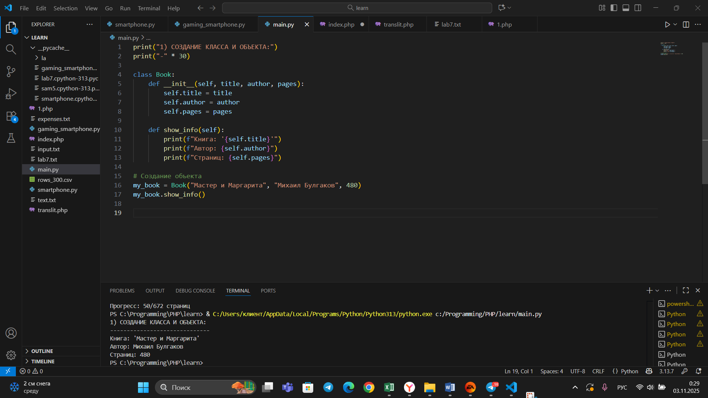
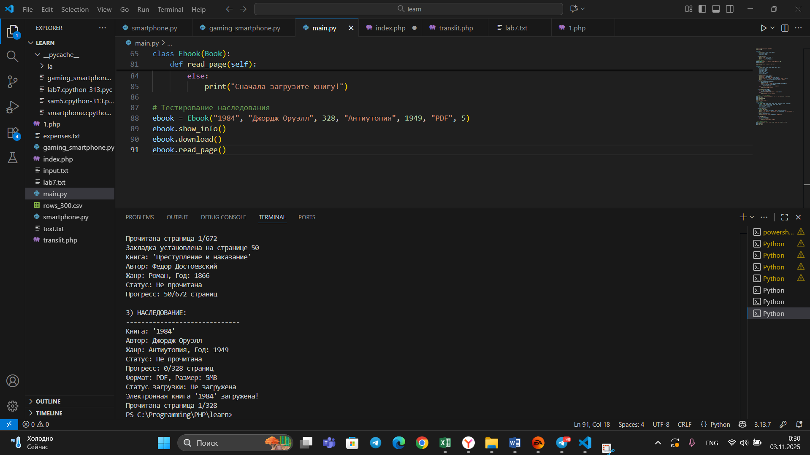
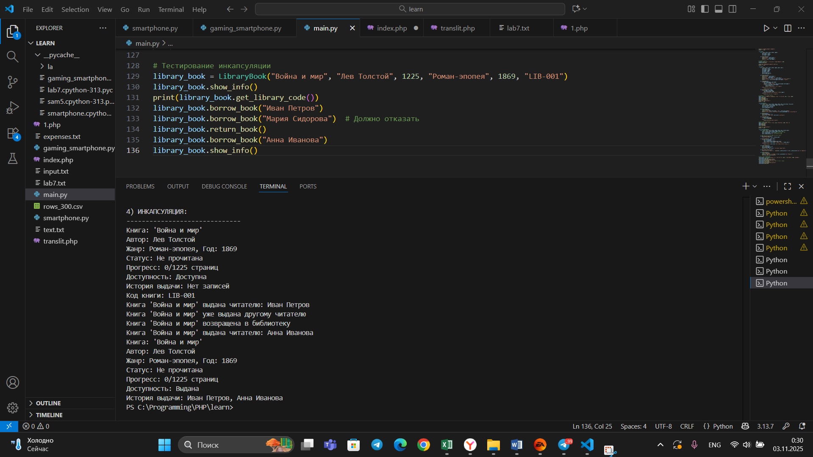
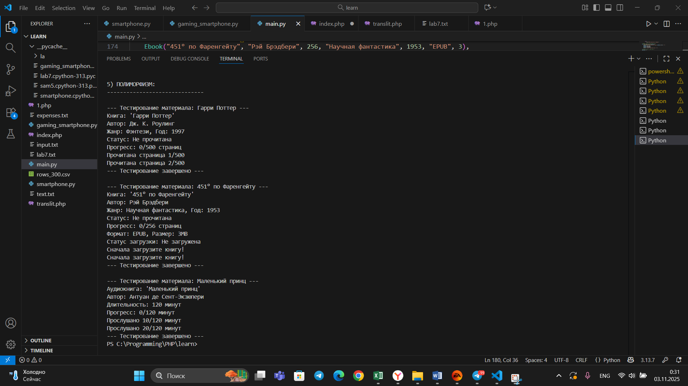

## Тема 4. Функции и модули
Отчет по теме № 3 подготовил(а):
Никитина Вероника Евгеньевна
Пиэ-23-1

| Заданияе | Выполнено |
|-----------|-----------|
| 1         | +         |
| 2         | +         |
| 3         | +         |
| 4         | +         |
| 5         | +         |


## Лабораторные задания
## Задание 1. 
```python
class Car:
    def __init__(self, make, model): #конструктор класса, который принимает 2 параметра
        self.make = make
        self.model = model

my_car = Car("Toyota", "Corolla") #создаем экземпляр класса
```
Результат:

## Вывод
Используем функцию и точку входа для функции.

## Задание 2. 
```python
class Car: #объявляем класс
    def __init__(self, make, model): #конструктор класса, который принимает 2 параметра
        self.make = make
        self.model = model

    def drive(self): #добавляем метод класса
        print(f"Driving the {self.make} {self.model}")

my_car = Car("Toyota", "Corolla") #создаем экземпляр класса
my_car.drive() #вызываем метод для созданного объекта 
```
Результат:

## Вывод
В этом случае спользуем return.

## Задание 3. 
```python
class Car:
    def __init__(self, make, model):
        self.make = make
        self.model = model

    def drive(self):
        print(f"Driving the {self.make} {self.model}")

class ElectricCar(Car): # Наследование от Car
    def __init__(self, make, model, battery_capacity):
        super().__init__(make, model) # вызываем конструктор родительского класса
        self.battery_capacity = battery_capacity # добавляем новый атрибут

    def charge(self): #создаем уникальный метод для класса ElectricCar
        print(f"Charging the {self.make} {self.model} with {self.battery_capacity} kWh")

my_electric_car = ElectricCar("Tesla", "Model S", 75)
my_electric_car.drive() # используем унаследованный метод
my_electric_car.charge() # используем собственный метод
```
Результат:

## Вывод
Используем функцию от 2 пременных.

## Задание 4. 

```python
class Car:
    def __init__(self, make, model):
        self._make = make # защищенный атрибут
        self.__model = model # приватный атрибут

    def drive(self):
        print(f"Driving the {self._make} {self.__model}") # метод имеет доступ ко всем атрибутам

my_car = Car("Toyota", "Corolla")
print(my_car._make) # вызова защищенного атрибута
my_car.drive() # вызов метода
```
Результат:

## Вывод
Научились писать функцию, на вход которой подается какое-то изначальное неизвестное количество аргументов, над которыми будет производится арифметические действия

## Задание 5. 
```python
class Shape: # общий класс
    def area(self):
        pass # абстрактный метод

class Rectangle(Shape): # Класс Прямоугольник, наследуется от Shape
    def __init__(self, width, height):
        self.width = width
        self.height = height

    def area(self):
        return self.width * self.height # реализация метода поиска площади для прямоугольника

class Circle(Shape): # класс Круг, наследуется от Shape
    def __init__(self, radius):
        self.radius = radius

    def area(self):
        return 3.14 * self.radius * self.radius # реализация метода поиска площади для круга

# создаем объекты
my_rectangle = Rectangle(5, 4)
my_circle = Circle(5)
# вызываем методы для поиска площади
print(my_rectangle.area())
print(my_circle.area())
```
Результат:

## Вывод
Научились писать функцию, которая на вход получает кортеж “**kwargs” и при помощи цикла выводит значения, поступившие в функцию.


## Самостоятельные задания
## Задание 1.
Результат:

## вывод
Docstring строка документации в Python. Нужна для автоматической генерации документации и помощи в IDE.
## Задание 2. 
Результат:

## вывод
Для генерации случайного числа использовалась функция randint, которая возвращает целое число в заданном диапазоне (в нашем случае от 1 до 6). В зависимости от результата выполняются соответствующие программе действия.
## Задание 3. 
Результат:

## вывод
Для вывода времени нужно импортировать модуль datetime и создать цикл, выводящий время 5 раз. Для паузы между выводами используется `time.sleep(1)`, который приостанавливает выполнение программы на 1 секунду.
## Задание 4. 
Результат:

## вывод
Функция принимает кортеж в качестве аргумента, что не ограничивает её работоспособность и не влияет на количество обрабатываемых параметров.
## Задание 5.
```python
from sam5 import square

if __name__ == '__main__':
    a = int(input("Введите a: "))
    b = int(input("Введите b: "))
    c = int(input("Введите c: "))
    print(square(a, b, c))
```
```python
from math import sqrt

def square(a, b, c):
    p = (a + b + c) / 2
    return sqrt(p * (p - a) * (p - b) * (p - c))
```
Результат:

## вывод
В первом файле импортируется функция square, получается пользовательский ввод трёх сторон треугольника и вызывается импортированная функция с этими аргументами для вычисления площади по формуле Герона.

## ОБЩИЙ ВЫВОД
В рамках изучения темы был успешно освоен комплекс практических навыков модульного программирования, включающий подключение внешних библиотек и использование их функций, создание собственных пользовательских функций, а также реализацию принципа единой точки входа и вызова всего функционала.
