## Тема 4. Функции и модули
Отчет по теме № 3 подготовил(а):
Никитина Вероника Евгеньевна
Пиэ-23-1

| Заданияе | Выполнено |
|-----------|-----------|
| 1         | +         |
| 2         | +         |
| 3         | +         |
| 4         | +         |
| 5         | +         |
| 6         | +         |
| 7         | +         |
| 8         | +         |
| 9         | +         |
| 10         | +         |

## Лабораторные задания
## Задание 1. 
Напишите функцию, которая выполняет любые арифметические действия и выводит результат в консоль. Вызовите функцию используя “точку входа”.
```python
def main():
    print(2 + 2)

if __name__ == '__main__':
    main()
```
Результат:
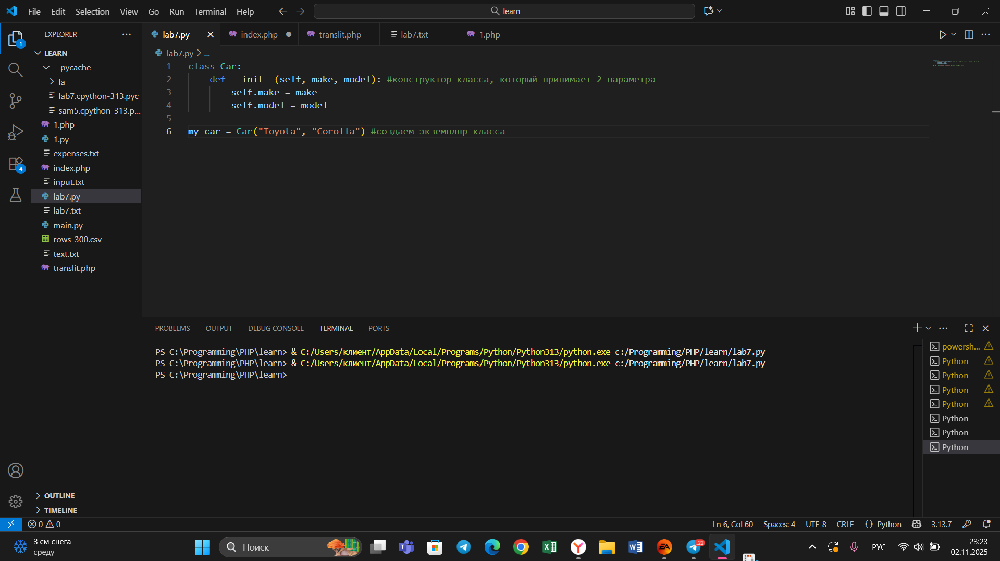
## Вывод
Используем функцию и точку входа для функции.
## Задание 2. 
Напишите функцию, которая выполняет любые арифметические действия, возвращает при помощи return значение в место, откуда вызывали функцию. Выведите результат в консоль. Вызовите функцию используя “точку входа”. Ниже представлена точно такая же программа, как и выше, только написана более развернуто. В это программе стоит заметить что результат работы функции main() мы помещаем в переменную “answer”, в дальнейшем можно как-то работать с ним, не вызывая функцию повторно, что хорошо сказывается, например, на скорости работы программы.
```python
def main():
    result = 2 + 2
    return result
if __name__ == '__main__':
    answer = main()
    print(answer)
```
Результат:
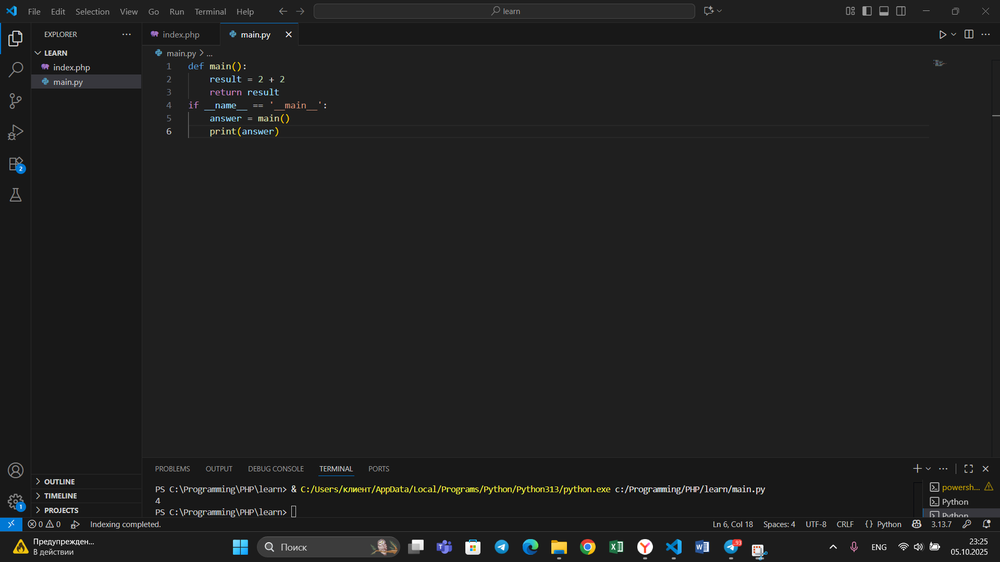
## Вывод
В этом случае спользуем return.
## Задание 3. 
Напишите функцию, в которую передаются два аргумента, над ними производится арифметическое действие, результат возвращается туда, откуда эту функцию вызывали. Выведите результат в консоль. Вызовите функцию в любом небольшом цикле. На скриншоте ниже приведен пример программы, в которой аргумент функции “x“превращается в параметр “one”, то же самое происходит с “y” и “two” Ниже представлена точно такая же программа, как и выше, только аргументы передаются в вызове функции, а не как отдельные переменные.
```python
def main(one, two):
    result = one + two
    return result
for i in range(5):
    x = 1
    y = 10
    answer = main(x, y)
    print(answer)
```
Результат:
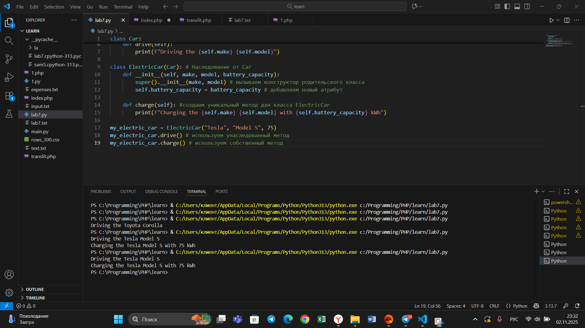
## Вывод
Используем функцию от 2 пременных.
## Задание 4. 
Напишите функцию, на вход которой подается какое-то изначальное неизвестное количество аргументов, над которыми будет производится арифметические действия. Для выполнения задания необходимо использовать кортеж “*args”. На скриншоте ниже приведен пример такой программы с комментариями. Для закрепления понимания работы с кортежами настоятельно рекомендуем поменять аргументы вызова функции, вручную посчитать результат, только потом запустить программу с новыми значениями и проверить себя, насколько вы поняли данный аспект программирования.
```python
def main(x, *args):
    one = x
    two = sum(args)
    three = float(len(args))
    print(f"one={one}\ntwo={two}\nthree={three}")
    return x + sum(args) / float(len(args))
if __name__ == '__main__':
    result = main(10, 0, 1, 2, -1, 0, -1, 1, 2)
    print(f"\nresult={result}")
```
Результат:
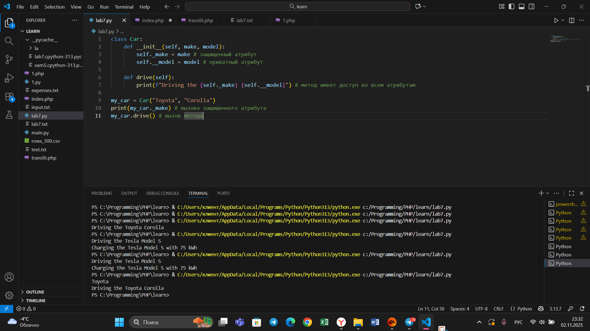
## Вывод
Научились писать функцию, на вход которой подается какое-то изначальное неизвестное количество аргументов, над которыми будет производится арифметические действия
## Задание 5. 
Напишите функцию, которая на вход получает кортеж “**kwargs” и при помощи цикла выводит значения, поступившие в функцию. На скриншоте ниже указаны два варианта вызова функции с “**kwargs” и два варианта работы с данными, поступившими в эту функцию. Комментарии в коде и теоретическая часть помогут вам разобраться в этом нелегком аспекте. Вызовите функцию используя “точку входа”.
```python
def main(**kwargs):
    for i in kwargs.items():
        print(i[0], i[1])
    print()
    for key in kwargs:
        print(f"{key} = {kwargs[key]}")
if __name__ == '__main__':
    main(x=[1, 2, 3], y=[3, 3, 0], z=[2, 3, 0], q=[3, 3, 0], w=[3, 3, 0])
    print()
    main(**{'x': [1, 2, 3], 'y': [3, 3, 0]})
```
Результат:
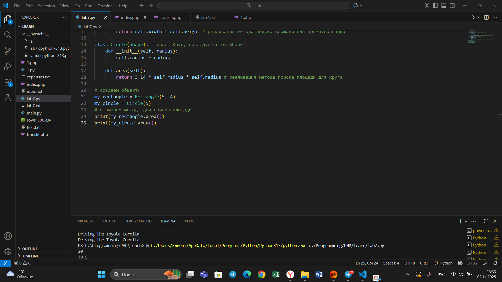
## Вывод
Научились писать функцию, которая на вход получает кортеж “**kwargs” и при помощи цикла выводит значения, поступившие в функцию.
## Задание 6. 
Напишите две функции. Первая – получает в виде параметра “**kwargs”. Вторая считает среднее арифметическое из значений первой функции. Вызовите первую функцию используя “точку входа” и минимум 4 аргумента.
```python
def main(**kwargs):
    for i, j in kwargs.items():
        print(f"{i}. Mean = {mean(j)}")

def mean(data):
    return sum(data) / float(len(data))

if __name__ == '__main__':
    main(x=[1, 2, 3], y=[3, 3, 0])
```
Результат:
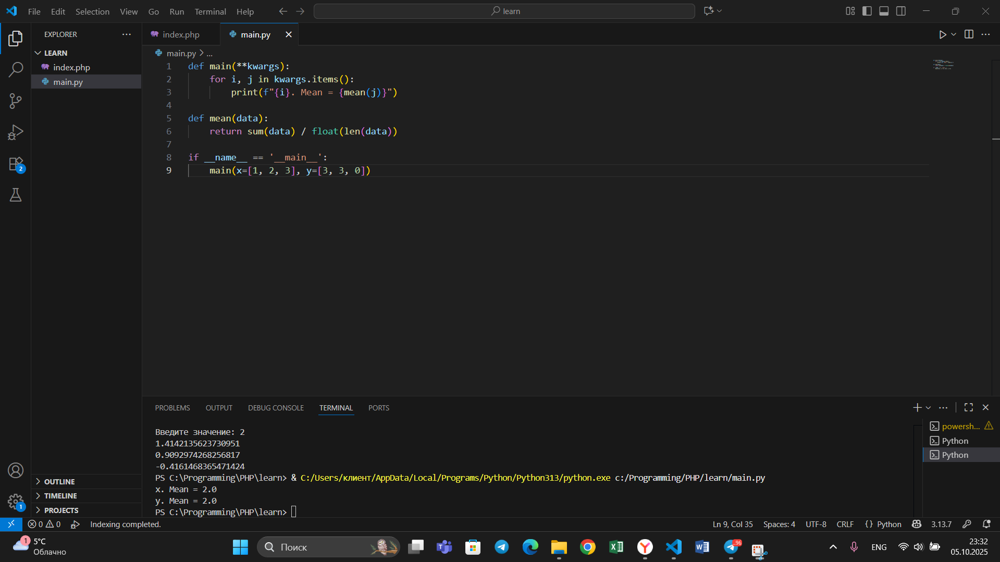
## Вывод
Научились писать функцию, которая считает среднее арифметическое из значений первой функции.
## Задание 7. 
Создайте дополнительный файл .py. Напишите в нем любую функцию, которая будет что угодно выводить в консоль, но не вызывайте ее в нем. Откройте файл main.py, импортируйте в него функцию из нового файла и при помощи “точки входа” вызовите эту функцию.
```python
def say_hello():
    print('Hello students')
```
```python
from lab4_7_1 import say_hello
if __name__ == '__main__':
    say_hello()
```
Результат:
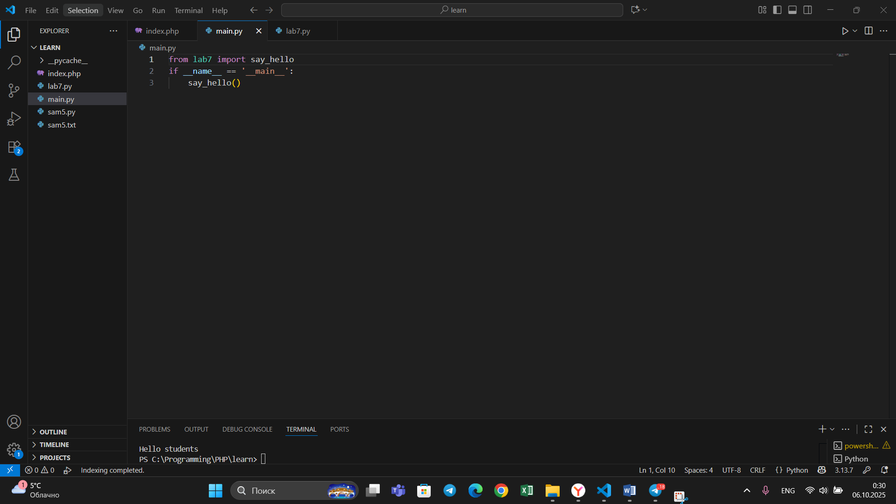
## Вывод
Что бы использования функции из другого файла, необходимо импортировать функцию и вызвать её.
## Задание 8. 
Напишите программу, которая будет выводить корень, синус, косинус полученного от пользователя числа. На первом скриншоте мы просто импортировали модуль math целиком и вызвали его длинным способом через math.название_фунции. Также импорт стандартного модуля в python возможно осуществить и другими способами, которые будут выполнять ту же самую функцию, но синтаксис будет немного отличатся. На втором скриншоте из модуля math мы загрузили в программу только 3 необходимые функции и обращались к ним так, будто они находятся у нас в файле просто через их название. Также замечу что мы импортировали три функции в одну строку, что очень удобно. На третьем скриншоте мы импортировали модуль math и при помощи оператора * загрузили все его функции. По большому счеты мы сделали то же самое что и на первом скриншоте, но у нас только поменялся синтаксис вызова этих функций, он стал похож на вызов со второго скриншота.
```python
from math import *

def main():
    value = int(input('Введите значение: '))
    print(sqrt(value))
    print(sin(value))
    print(cos(value))

if __name__ == '__main__':
    main()
```
Результат:
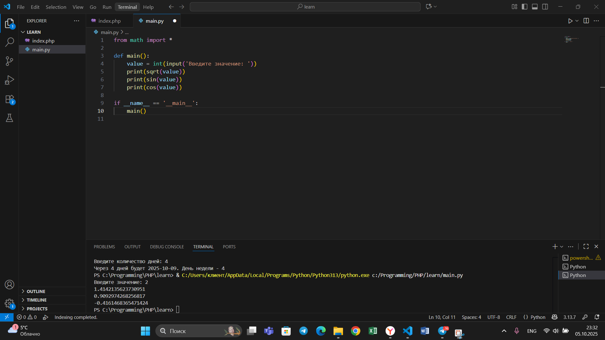
## Вывод
Научились писать программу, которая будет выводить корень, синус, косинус полученного от пользователя числа.
## Задание 9. 
Напишите программу, которая будет рассчитывать какой день недели будет через n-нное количество дней, которые укажет пользователь. В результате день недели указан в виде цифры, где 1 = понедельник, 2 = вторник, 3 = среда и так далее.
```python
from datetime import datetime as dt
from datetime import timedelta as td

def main():
    print(
        f"Сегодня {dt.today().date()}. "
        f"День недели - {dt.today().isoweekday()}"
    )
    n = int(input('Введите количество дней: '))
    today = dt.today()
    result = today + td(days=n)
    print(
        f"Через {n} дней будет {result.date()}. "
        f"День недели - {result.isoweekday()}"
    )

if __name__ == '__main__':
    main()
```
Результат:
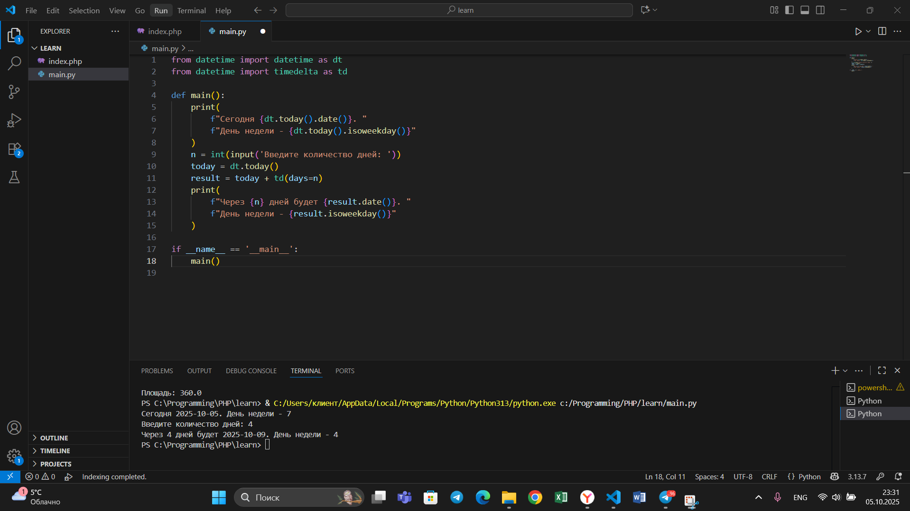

## Вывод
Научились писать программу, которая будет рассчитывать какой день недели будет через n-нное количество дней, которые укажет пользователь.
## Задание 10. 
Напишите программу с использованием глобальных переменных, которая будет считать площадь треугольника или прямоугольника в зависимости от того, что выберет пользователь. Получение всей необходимой информации реализовать через input(), а подсчет площадей выполнить при помощи функций. Результатом программы будет число, равное площади, необходимой фигуры.
```python
global result
def rectangle():
    a = float(input("Ширина: "))
    b = float(input("Высота: "))
    global result
    result = a * b
def triangle():
    a = float(input("Основание: "))
    h = float(input("Высота: "))
    global result
    result = 0.5 * a * h
figure = input("1-прямоугольник, 2-треугольник: ")
if figure == '1':
    rectangle()
elif figure == '2':
    triangle()
print(f"Площадь: {result}")
```
Результат:
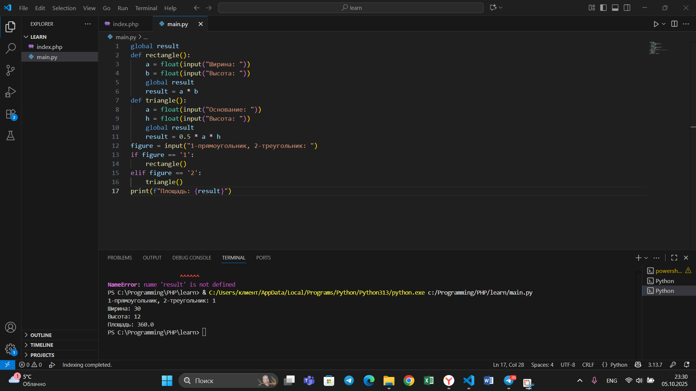

## Вывод
Научились писать программу с использованием глобальных переменных, которая будет считать площадь треугольника или прямоугольника в зависимости от того, что выберет пользователь.

## Самостоятельные задания
## Задание 1.
Результат:
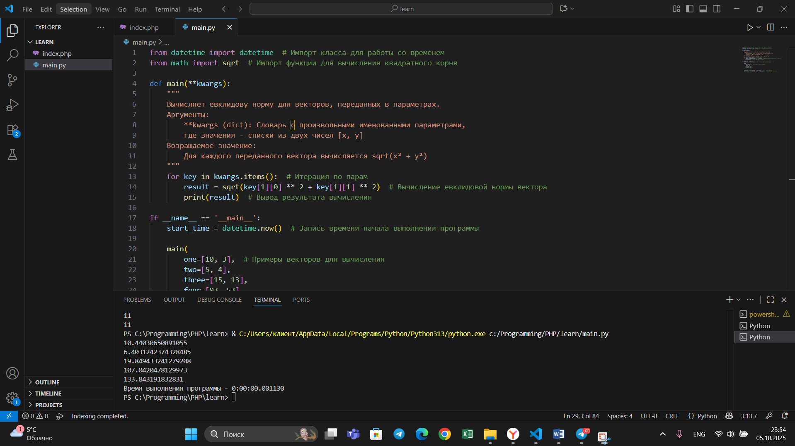
## вывод
Docstring строка документации в Python. Нужна для автоматической генерации документации и помощи в IDE.
## Задание 2. 
Результат:
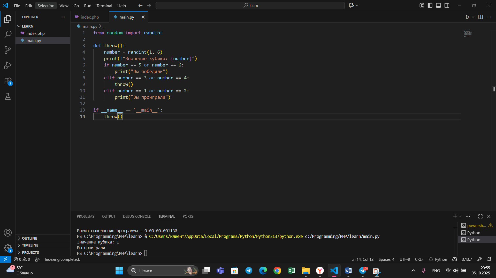
## вывод
Для генерации случайного числа использовалась функция randint, которая возвращает целое число в заданном диапазоне (в нашем случае от 1 до 6). В зависимости от результата выполняются соответствующие программе действия.
## Задание 3. 
Результат:
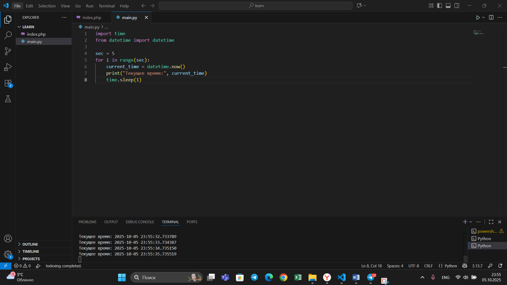
## вывод
Для вывода времени нужно импортировать модуль datetime и создать цикл, выводящий время 5 раз. Для паузы между выводами используется `time.sleep(1)`, который приостанавливает выполнение программы на 1 секунду.
## Задание 4. 
Результат:
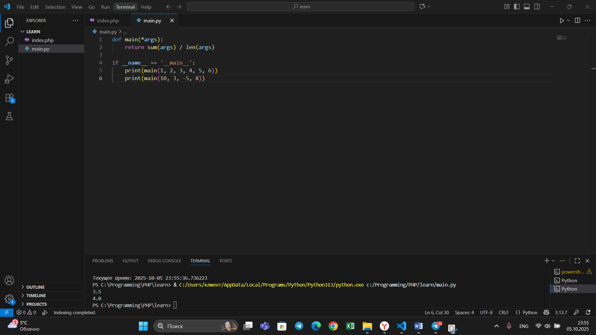
## вывод
Функция принимает кортеж в качестве аргумента, что не ограничивает её работоспособность и не влияет на количество обрабатываемых параметров.
## Задание 5.
Результат:
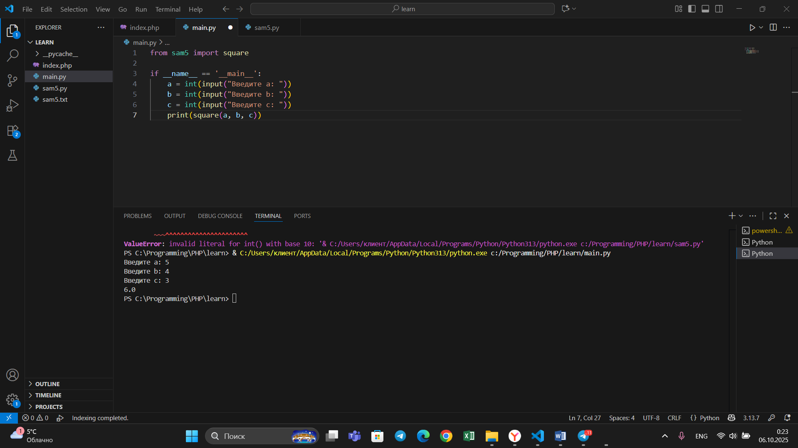
## вывод
В первом файле импортируется функция square, получается пользовательский ввод трёх сторон треугольника и вызывается импортированная функция с этими аргументами для вычисления площади по формуле Герона.

## ОБЩИЙ ВЫВОД
В рамках изучения темы был успешно освоен комплекс практических навыков модульного программирования, включающий подключение внешних библиотек и использование их функций, создание собственных пользовательских функций, а также реализацию принципа единой точки входа и вызова всего функционала.
