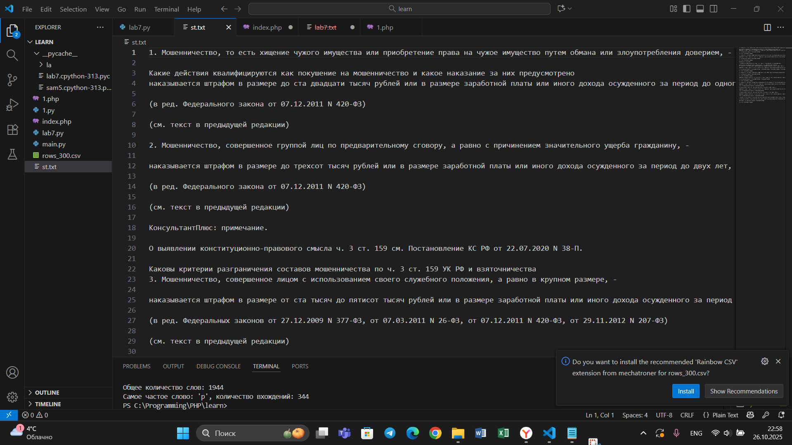

## Тема 9. Концепции и принципы ООП.
Отчет по теме № 9 подготовил(а):
Никитина Вероника Евгеньевна
Пиэ-23-1

| Заданияе | Выполнено |
|-----------|-----------|
| 1         | +         |
| 2         | +         |
| 3         | +         |
| 4         | +         |
| 5         | +         |
| 6         | +         |
| 7         | +         |
| 8         | +         |
| 9         | +         |
| 10        | +         |

## Лабораторные задания
## Задание 1. 
Допустим, вы решили оригинально и немного странно познакомиться с человеком. Для этого вам нужно написать свой класс на Python, который будет проверять, угадал человек ваше имя или нет. Для этого создайте класс, указав в свойствах только имя. Затем создайте функцию init(), а в ней проведите проверку, угадал человек ваше имя или нет. Также можете проверить, что произойдёт, если в этой функции указать атрибут, которого нет в вашем классе, например, попробовать вызвать фамилию.
```python
python
class Ivan:
    __slots__ = ['name']

    def __init__(self, name):
        if name == 'Иван':
            self.name = f"Да, я {name}"
        else:
            self.name = f"Я не {name}, а Иван"

person1 = Ivan('Алексей')
person2 = Ivan('Иван')
print(person1.name)
print(person2.name)
```
Результат.

# Выводы  
С помощью функции get программа получает значения из созданного словаря.

## Задание 2. 
Вам дали важное задание: написать программу для продавца мороженого, которая будет определять, добавили ли в мороженое топпинг, и указывать цену после возможного изменения состава. Для этого вам нужно написать класс, в котором будет определяться, изменился ли состав мороженого. В этом классе реализуйте метод, который выводит на печать «Мороженое с {ТОППИНГОМ}» в случае наличия добавки, а в противном случае выводит следующую фразу: «Обычное мороженое». При этом программа должна воспринимать в качестве топпинга только атрибуты типа string.
```python
class Icecream:
    def __init__(self, ingredient=None):
        if isinstance(ingredient, str):
            self.ingredient = ingredient
        else:
            self.ingredient = None

    def composition(self):
        if self.ingredient:
            print(f"Мороженое с {self.ingredient}")
        else:
            print("Обычное мороженое")

icecream = Icecream()
icecream.composition()
icecream = Icecream('шоколадом')
icecream.composition()
icecream = Icecream(5)
icecream.composition()
```
Результат.


# Выводы  
Метод update позволяет дополнять словарь новыми записями и изменять значения существующих ключей. Исходные данные в словаре остаются неизменными до применения этой функции.

## Задание 3. 
Петя — начинающий программист, и на занятиях ему сказали реализовать икапсу… что-то. А вы — хороший друг Пети и к тому же прекрасно знаете, что икапсу… что-то — это инкапсуляция, поэтому решаете помочь другу с написанием класса с инкапсуляцией. Ваш класс будет не просто инкапсуляцией, а классом с сеттером, геттером и деструктором. После написания класса вам нужно продемонстрировать, что все написанные вами функции работают. Также вам нужно объяснить Пете, почему на скриншоте ниже в консоли выводится ошибка.
```python
class MyClass:
    def __init__(self, value):
        self._value = value

    def set_value(self, value):
        self._value = value

    def get_value(self):
        return self._value

    def del_value(self):
        del self._value

    value = property(get_value, set_value, del_value, "Свойство value")

obj = MyClass(42)
print(obj.get_value())
obj.set_value(45)
print(obj.get_value())
obj.set_value(100)
print(obj.get_value())
obj.del_value()
print(obj.get_value()))
```

Результат.

# Выводы  
Кортеж можно рассматривать как альтернативный способ разбиения строки на символы. Его неизменяемость гарантирует, что полученная последовательность символов останется защищенной от изменений.

## Задание 4.
Вам прекрасно известно, что кошки и собаки — это млекопитающие, но компьютер этого не понимает, поэтому вам нужно создать три класса: «Кошки», «Собаки», «Млекопитающие». И с помощью «наследования» объяснить компьютеру, что кошки и собаки — это млекопитающие. Также добавьте какой-нибудь атрибут для кошек и собак, чтобы показать, что они чем-то отличаются друг от друга.
```python
class Mammal:
    className = 'Mammal'

class Dog(Mammal):
    species = 'canine'
    sounds = 'wow'

class Cat(Mammal):
    species = 'feline'
    sounds = 'meow'

dog = Dog()
print(f"Dog is {dog.className}, but they say {dog.sounds}")
cat = Cat()
print(f"Cat is {cat.className}, but they say {cat.sounds}")
```

Результат.

# Выводы  
Функция может принимать кортеж в качестве аргумента и обрабатывать его.

## Задание 5. 
На разных языках здороваются по-разному, но суть остается одинаковой, люди друг с другом здороваются. Давайте вместе с вами реализуем программу с полиморфизмом, которая будет описывать всю суть первого предложения задачи. Для этого мы можем выбрать два языка, например, русский и английский и написать для них отдельные классы, в которых будет в виде атрибута слово, которым здороваются на этих языках. А также напишем функцию, которая будет выводить информацию о том, как на этих языках здороваются. Заметьте, что для решения поставленной задачи мы использовали декоратор @staticmethod, поскольку нам не нужны обязательные параметры-ссылки вроде self.
```python
class Russian:
    @staticmethod
    def greeting():
        print("Привет")

class English:
    @staticmethod
    def greeting():
        print("Hello")

def greet(language):
    language.greeting()

ivan = Russian()
greet(ivan)
john = English()
greet(john)
```

Результат.

# Выводы  
Чтобы проверить элементы кортежа на принадлежность к дробным числам, можно использовать isinstance(), указав в качестве параметров проверяемый объект и класс float.


## Самостоятельные адания
## Задание 1. 
Классовая структура:
Есть Помидор со следующими характеристиками:
• Индекс
• Стадия созревания (стадии: отсутствует, цветение, зеленый, красный)
Помидор может:
• Расти (переходить на следующую стадию созревания)
• Предоставлять информацию о своей зрелости
Есть Куст с помидорами, который:
• Содержит список томатов, которые на нем растут
А также может:
• Расти вместе с томатами
• Предоставлять информацию о зрелости всех томатов
• Предоставлять урожай
И также есть Садовник, который имеет:
• Имя
• Растение, за которым он ухаживает
Он может:
• Ухаживать за растением
• Собирать с него урожай
Задание:
Класс Tomato:
1) Создайте класс Tomato
2) Создайте статическое свойство states, которое будет содержать все стадии созревания помидора
3) Создайте метод __init__(), внутри которого будут определены два динамических свойства: _index (передается параметром) и _state (принимает первое значение из словаря states). После написания этого блока кода в комментарии к нему укажите какими являются эти два свойства
4) Создайте метод grow(), который будет переводить томат на следующую стадию созревания
5) Создайте метод is_ripe(), который будет проверять, что томат созрел
Класс TomatoBush:
1) Создайте класс TomatoBush
2) Определите метод __init__(), который будет принимать в качестве параметра количество томатов и на его основе будет создавать список объектов класса Tomato. Данный список будет храниться внутри динамического свойства tomatoes 3) Создайте метод grow_all(), который будет переводить все объекты из списка томатов на следующий этап созревания
4) Создайте метод all_are_ripe(), который будет возвращать True, если все томаты из списка стали спелыми.
5) Создайте метод give_away_all(), который будет чистить список томатов после сбора урожая
Класс Gardener:
1) Создайте класс Gardener
2) Создайте метод __init__(), внутри которого будут определены два динамических свойства: name (передается параметром, является публичным) и _plant (принимает объект класса TomatoBush). После написания этого блока кода в комментарии к нему укажите какими являются эти два свойства
3) Создайте метод work(), который заставляет садовника работать, что позволяет растению становиться более зрелым
4) Создайте метод harvest(), который проверяет, все ли плоды созрели. Если все, то садовник собирает урожай. Если нет, то метод печатает предупреждение
5) Создайте статический метод knowledge_base(), который выведет в консоль справку по садоводству
Тесты:
1) Вызовите справку по садоводству
2) Создайте объекты классов TomatoBush и Gardener 3) Используя объект класса Gardener, поухаживайте за кустом с помидорами
4) Попробуйте собрать урожай, когда томаты еще не дозрели. Продолжайте ухаживать за ними
5) Соберите урожай
Результатом работы вашей программы будет листинг кода с подробными
комментариями и скриншоты выполенния всех тестов.
```python
class Tomato:
    states = ['отсутствует', 'цветение', 'зеленый', 'красный']
    
    def __init__(self, index):
        self._index = index
        self._state = self.states[0]
    
    def grow(self):
        current_index = self.states.index(self._state)
        if current_index < len(self.states) - 1:
            self._state = self.states[current_index + 1]
    
    def is_ripe(self):
        return self._state == 'красный'
    
    def __str__(self):
        return f"Помидор {self._index}: {self._state}"


class TomatoBush:
    def __init__(self, num_tomatoes):
        self.tomatoes = [Tomato(i) for i in range(1, num_tomatoes + 1)]
    
    def grow_all(self):
        for tomato in self.tomatoes:
            tomato.grow()
    
    def all_are_ripe(self):
        return all(tomato.is_ripe() for tomato in self.tomatoes)
    
    def give_away_all(self):
        self.tomatoes.clear()
    
    def get_tomatoes_info(self):
        return [str(tomato) for tomato in self.tomatoes]


class Gardener:
    def __init__(self, name, plant):
        self.name = name
        self._plant = plant
    
    @staticmethod
    def knowledge_base():
        print("=" * 50)
        print("СПРАВКА ПО САДОВОДСТВУ")
        print("=" * 50)
        print("Стадии созревания помидора:")
        for i, stage in enumerate(Tomato.states):
            print(f"  {i+1}. {stage}")
        print("\nСоветы:")
        print("  - Регулярно ухаживайте за растениями")
        print("  - Собирайте урожай только когда все помидоры красные")
        print("  - После сбора урожая куст очищается")
        print("=" * 50)
        print()
    
    def work(self):
        print(f"{self.name} ухаживает за кустом с помидорами...")
        self._plant.grow_all()
        self.show_plant_status()
    
    def harvest(self):
        if self._plant.all_are_ripe():
            print(f"{self.name} собирает урожай!")
            harvested_count = len(self._plant.tomatoes)
            self._plant.give_away_all()
            print(f"Урожай собран! Собрано {harvested_count} помидоров.")
            return True
        else:
            print(f"{self.name}: Помидоры еще не созрели! Нужно продолжать ухаживать.")
            return False
    
    def show_plant_status(self):
        print(f"Текущее состояние куста:")
        for tomato_info in self._plant.get_tomatoes_info():
            print(f"  {tomato_info}")
        print()


if __name__ == "__main__":
    print("НАЧАЛО ТЕСТИРОВАНИЯ")
    print("=" * 60)
    
    print("1. ВЫЗОВ СПРАВКИ ПО САДОВОДСТВУ:")
    Gardener.knowledge_base()
    
    print("2. СОЗДАНИЕ ОБЪЕКТОВ:")
    bush = TomatoBush(3)
    gardener = Gardener("Иван", bush)
    
    print(f"Создан куст с {len(bush.tomatoes)} помидорами")
    print(f"Создан садовник: {gardener.name}")
    gardener.show_plant_status()
    
    print("3. УХОД ЗА РАСТЕНИЯМИ:")
    for day in range(1, 4):
        print(f"--- День {day} ---")
        gardener.work()
    
    print("4. ПЕРВАЯ ПОПЫТКА СБОРА УРОЖАЯ:")
    gardener.harvest()
    
    print("\n5. ПРОДОЛЖАЕМ УХАЖИВАТЬ:")
    for day in range(4, 6):
        print(f"--- День {day} ---")
        gardener.work()
    
    print("6. ФИНАЛЬНАЯ ПОПЫТКА СБОРА УРОЖАЯ:")
    success = gardener.harvest()
    
    if success:
        print("УРОЖАЙ УСПЕШНО СОБРАН!")
    else:
        print("Урожай еще не готов...")
    
    print("\n" + "=" * 60)
    print("ТЕСТИРОВАНИЕ ЗАВЕРШЕНО")
```


# Выводы  
В данном коде реализована система управления выращиванием помидоров с использованием ООП:
Класс Tomato:
- states - статическое свойство со стадиями созревания
- _index и _state - защищенные свойства
- grow() - меняет стадию созревания
- is_ripe() - проверяет достижение финальной стадии

Класс TomatoBush:
- tomatoes - список объектов Tomato
- grow_all() - применяет grow() ко всем томатам
- all_are_ripe() - проверяет готовность всех томатов
- give_away_all() - очищает список после сбора

Класс Gardener:
- name - публичное свойство
- _plant - защищенное свойство (композиция)
- work() - делегирует рост растению
- harvest() - собирает урожай при готовности
- knowledge_base() - статический метод со справочной информацией

Основные принципы ООП:
- Инкапсуляция: защищенные свойства и сокрытие реализации
- Композиция: Gardener содержит TomatoBush, который содержит Tomato
- Полиморфизм: единый интерфейс для работы с разными объектами
- Статические методы: общая функциональность без создания экземпляра


# Общие выводы  
Все задачи решены успешно
