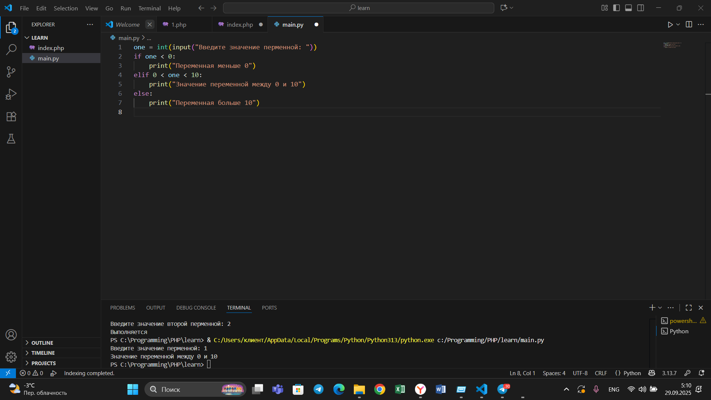

## Тема 3. Операторы, условия, циклы
Отчет по теме № 3 подготовил(а):
Никитина Вероника Евгеньевна
Пиэ-23-1

| Заданияе | Выполнено |
|-----------|-----------|
| 1         | +         |
| 2         | +         |
| 3         | +         |
| 4         | +         |
| 5         | +         |
| 6         | +         |
| 7         | +         |
| 8         | +         |
| 9         | +         |
| 10         | +         |

## Лабораторные задания
## Задание 1. 
Создайте две переменные, значение которых будете вводить через консоль. Также составьте условие, в котором созданные ранее переменные будут сравниваться, если условие выполняется, то выведете в консоль «Выполняется», если нет, то «Не выполняется».
```python
one = int(input("Введите значение первой перменной: "))
two = int(input("Введите значение второй перменной: "))
if one >= two:
    print("Выполняется")
else:
    print("Не выполняется")
```
Результат.

# Выводы  
Использовали функцию Если, иначе, для того что бы сравнить два числа.

## Задание 2. 
Напишите программу, которая будет определять значения переменной меньше 0, больше 0 и меньше 10 или больше 10. Это нужно реализовать при помощи одной переменной, значение которой будет вводится через консоль, а также при помощи конструкций if, elif, else.
```python
one = int(input("Введите значение перменной: "))
if one < 0:
    print("Переменная меньше 0")
elif 0 < one < 10:
    print("Значение переменной между 0 и 10")
else:
    print("Переменная больше 10")
```
Результат.

# Выводы  
Определяем в каком чисовом промежутке находится число.

## Задание 3. 
Напишите программу, в которой будет проверяться есть ли переменная в указанном массиве используя логический оператор in. Самостоятельно посмотрите, как работает программа со значениями которых нет в массиве numbers.
```python
numbers = [1, 3, 4, 6, 8, 9]
value = int(input("Ведите значение переменной: "))
if value in numbers:
    print("Переменная есть в массиве")
else:
    print("Переменной нет в массиве")
```
Результат.

# Выводы  
С помозью оператора in можно проверять наличие переменной в массиве.

## Задание 4. 

# Выводы  
Так же как и впрошлом задание ищем пременную в массиве и затем проверяем на чётность.

## Задание 5. 

# Выводы  
Смотрим как разные виды сравнений и операаций могут работать в цикле.

## Задание 6. 

# Выводы  
С помощью оператора in и index = string.find(value) мы можем проверять есть ли определённый символ в строке.

## Задание 7. 

# Выводы 
В этом задание наглядно посмотрели как работаец цикл for.

## Задание 8. 

# Выводы  
Для работы цикла while нам необходимо задать условие, выполнение которого гарантирует окончание цикла.

## Задание 9. 

# Выводы  
Нельзя спользовать одинаковые имена интеграрованных переменных при использовании вложенных циклов.

## Задание 10. 

# Выводы  
Можно использовать flag для определения четности или нечетности числа.

## Самостоятельные адания
## Задание 1. 

# Выводы  
С помощью двух интеграций достигли желаемого результата.

## Задание 2. 

# Выводы  
Я спользовала for...in что бы написать слово в обратно порядке.

## Задание 3. 

# Выводы  
Для решения задания я использовала два вложенных цикла.

## Задание 4. 

# Выводы  
В этом задание разбираем предложение, заменяем нужные слова.

## Задание 5. 

# Выводы  
Программа выводит Hello и Hello word 10 раз.

# Общие выводы  
В этой теме использовались разные виды циклов, конструкций и операторов. В резельтате были освоены if, elif, else, цикл for и while.
