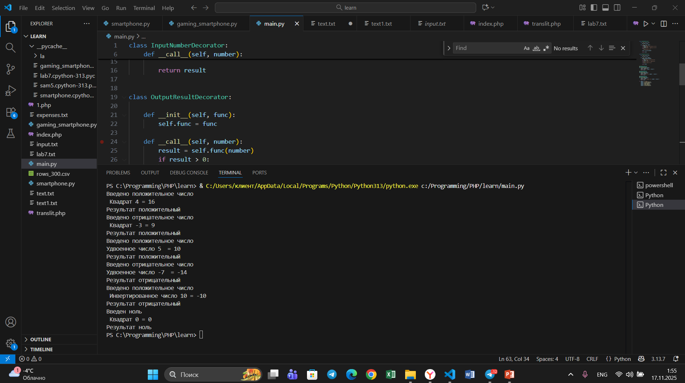
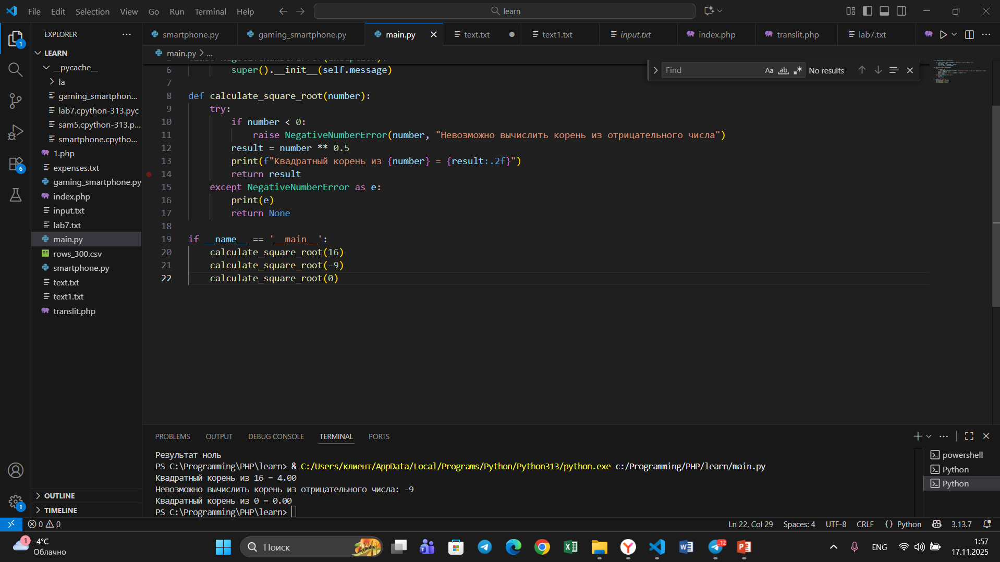

## Тема 11. Итераторы и генераторы
Отчет по теме № 11 подготовил(а):
Никитина Вероника Евгеньевна
Пиэ-23-1

| Заданияе | Выполнено |
|-----------|-----------|
| 1         | +         |
| 2         | +         |
| 3         | +         |
| 4         | +         |
| 5         | +         |

## Лабораторные задания
## Задание 1. 
Простой итератор, но у него нет гибкой настройки, например его нельзя развернуть. Он работает просто как next(), но нет prev()
```python
numbers = [0, 1, 2, 3, 4, 5]
for item in numbers:
    print(item)
```
Результат.

# Выводы  
Применили @lru_cache для кеширования результатов функции. Это ускорило вычисление чисел Фибоначчи при повторных вызовах с одинаковыми аргументами.

## Задание 2. 
Класс итератор с гибкой настройкой и удобными применением
```python
class CountDown:
    def __init__(self, start):
        self.count = start + 1

    def __iter__(self):
        return self

    def __next__(self):
        self.count -= 1
        if self.count < 0:
            raise StopIteration
        return self.count

counter = CountDown(5)
for i in counter:
    print(i)
```
Результат.


# Выводы  
Декоратор check перехватывает аргументы name и age функции personal_info() через параметр *args во внутренней функции-обёртке output_func.

## Задание 3. 
Генератор списка
```python
a = [i ** 2 for i in range(1, 5)]

print('a - ', a)
for i in a:
    print(i)

print('iter(a) - ', iter(a))
for i in a:
    print(i)
```

Результат.

# Выводы  
Используем except Exception as ex для перехвата всех стандартных ошибок. Это позволяет обрабатывать исключения (например, строковые значения) без остановки программы.

## Задание 4.
Выражения генераторы
```python
b = (i ** 2 for i in range(1, 5))
print(b)
print('first')
for i in b:
    print(i)
print('second')

for i in b:
    print(i)
```

Результат.

# Выводы  
Используем raise NegativeValueException() для принудительного выброса исключения, когда аргумент выходит за допустимый диапазон.

## Задание 5. 
Такой же счетчик, как и в первом задании, только это генератор и использует yield
```python
def countdown(count):
    while count >= 0:
        yield count
        count -= 1

counter = countdown(5)
for i in counter:
    print(i)
```

Результат.

# Выводы  
Декоратор @SiteChecker заменяет функцию site() на объект SiteChecker, поэтому при вызове site() выполняется метод __call__ декоратора.


## Самостоятельные адания
## Задание 1. 
Вас никак не могут оставить числа Фибоначчи, очень уж они вас заинтересовали. Изучив новые возможности Python вы решили реализовать программу, которая считает числа Фибоначчи при помощи итераторов. Расчет начинается с чисел 1 и 1. Создайте функцию fib(n), генерирующую n чисел Фибоначчи с минимальными затратами ресурсов. Для реализации этой функции потребуется обратиться к инструкции yield (Она не сохраняет в оперативной памяти огромную последовательность, а дает возможность “доставать” промежуточные результаты по одному). Результатом решения задачи будет листинг кода и вывод в консоль с числом Фибоначчи от 200.
```python
import time
def timer(func):
    def wrapper():
        start_time = time.time()
        func()
        end_time = time.time()
        print(f"\nВремя выполнения: {end_time - start_time:.6f} секунд")

    return wrapper

@timer
def fibonacci():
    fib1 = fib2 = 1
    print(fib1, fib2, end=' ')

    for i in range(2, 200):
        fib1, fib2 = fib2, fib1 + fib2
        print(fib2, end=' ')

if __name__ == '__main__':
    fibonacci()
```

# Выводы  
Декоратор @timer измеряет время выполнения функции fibonacci(), вычисляя разницу между началом и концом её работы.

## Задание 2. 
Посмотрев на Вовочку, вы также загорелись идеей спортивного программирования, начав тренировки вы узнали, что для решения некоторых задач необходимо считывать данные из файлов. Но через некоторое время вы столкнулись с проблемой что файлы бывают пустыми, и вы не получаете вводные данные для решения задачи. После этого вы решили не просто считывать данные из файла, а всю конструкцию оборачивать в исключения, чтобы избежать такой проблемы. Создайте пустой файл и файл, в котором есть какая-то информация. Напишите код программы. Если файл пустой, то, нужно вызвать исключение ("бросить исключение") и вывести в консоль "файл пустой", а если он не пустой, то вывести информацию из файла.
```python
def read_file_content(filename):
    try:
        with open(filename, 'r', encoding='utf-8') as file:
            content = file.read()
            if not content.strip():
                raise Exception("файл пустой")
            print(f"Содержимое файла: {content}")
    except FileNotFoundError:
        print("Файл не найден")
    except Exception as e:
        print(e)

if __name__ == '__main__':
    read_file_content('txt1.txt')
    read_file_content('txt2.txt')
```
Результат.


# Выводы  
Программа проверяет: если файл пустой — вызывает исключение, если файл не существует — обрабатывает FileNotFoundError, иначе выводит содержимое. Все остальные ошибки перехватываются через except Exception.

## Задание 3. 
Напишите функцию, которая будет складывать 2 и введенное пользователем число, но если пользователь введет строку или другой неподходящий тип данных, то в консоль выведется ошибка "Неподходящий тип данных. Ожидалось число.". Реализовать функционал программы необходимо через try/except и подобрать правильный тип исключения. Создавать собственное исключение нельзя. Проведите несколько тестов, в которых исключение вызывается и нет. Результатом выполнения задачи будет листинг кода и получившийся вывод в консоль
```python
def add_two():
    try:
        user_input = input("Введите число: ")
        number = float(user_input)
        result = 2 + number
        print(result)
    except ValueError:
        print("Неподходящий тип данных. Ожидалось число.")

if __name__ == '__main__':
    add_two()
    add_two()
    add_two()
```

Результат.

# Выводы  
Программа обрабатывает ValueError при вводе нечисловых данных, выводя сообщение об ошибке. Успешное выполнение происходит только при вводе числа.

## Задание 4.
Создайте собственный декоратор, который будет использоваться для двух любых вами придуманных функций. Декораторы, которые использовались ранее в работе нельзя воссоздавать. Результатом выполнения задачи будет: класс декоратора, две как-то связанными с ним функциями, скриншот консоли с выполненной программой и подробные комментарии, которые будут описывать работу вашего кода.
```python
class InputNumberDecorator:

    def __init__(self, func):
        self.func = func

    def __call__(self, number):
        if number > 0:
            print("Введено положительное число")
        elif number < 0:
            print("Введено отрицательное число")
        else:
            print("Введен ноль")

        result = self.func(number)

        return result


class OutputResultDecorator:

    def __init__(self, func):
        self.func = func

    def __call__(self, number):
        result = self.func(number)
        if result > 0:
            print("Результат положительный")
        elif result < 0:
            print("Результат отрицательный")
        else:
            print("Результат ноль")

        return result


@OutputResultDecorator
@InputNumberDecorator
def calculate_square(number):
    result = number ** 2
    print(f" Квадрат {number} = {result}")
    return result

@OutputResultDecorator
@InputNumberDecorator
def double_number(number):
    result = number * 2
    print(f"Удвоенное число {number}  = {result}")
    return result

@OutputResultDecorator
@InputNumberDecorator
def invert_number(number):
    result = -number
    print(f" Инвертированное число {number} = {result}")
    return result

if __name__ == '__main__':
    result1 = calculate_square(4)
    result2 = calculate_square(-3)
    result3 = double_number(5)
    result4 = double_number(-7)
    result5 = invert_number(10)
    result6 = calculate_square(0)
```

Результат.

# Выводы  
Создали два декоратора: первый проверяет входные числа функций, второй — их результаты. Применяем к функциям calculate_square, double_number и invert_number.

## Задание 5. 
Создайте собственное исключение, которое будет использоваться в двух любых фрагментах кода. Исключения, которые использовались ранее в работе нельзя воссоздавать. Результатом выполнения задачи будет: класс исключения, код к котором в двух местах используется это исключение, скриншот консоли с выполненной программой и подробные комментарии, которые будут описывать работу вашего кода.
```python
class NegativeNumberError(Exception):

    def __init__(self, value, message="Отрицательные числа не допускаются"):
        self.value = value
        self.message = f"{message}: {value}"
        super().__init__(self.message)

def calculate_square_root(number):
    try:
        if number < 0:
            raise NegativeNumberError(number, "Невозможно вычислить корень из отрицательного числа")
        result = number ** 0.5
        print(f"Квадратный корень из {number} = {result:.2f}")
        return result
    except NegativeNumberError as e:
        print(e)
        return None

if __name__ == '__main__':
    calculate_square_root(16)
    calculate_square_root(-9)
    calculate_square_root(0)
```

Результат.

# Выводы  
При вычислении корня из отрицательного числа вызываем исключение NegativeNumberError с указанием проблемного числа и сообщением.

# Общие выводы  
Все задачи решены успешно
