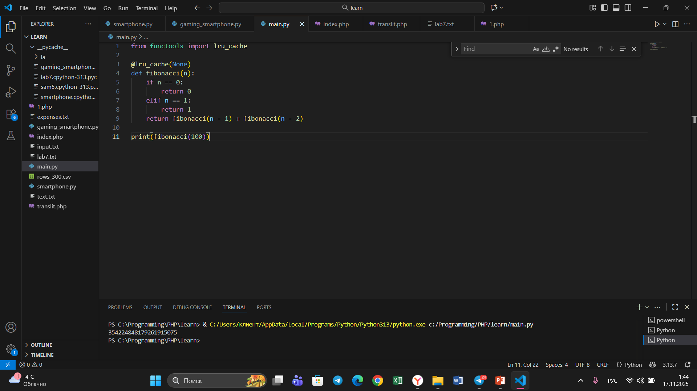
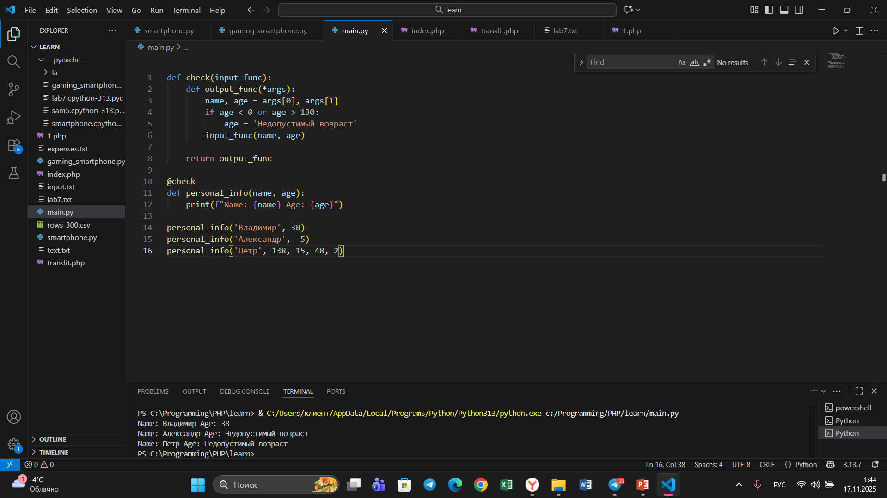
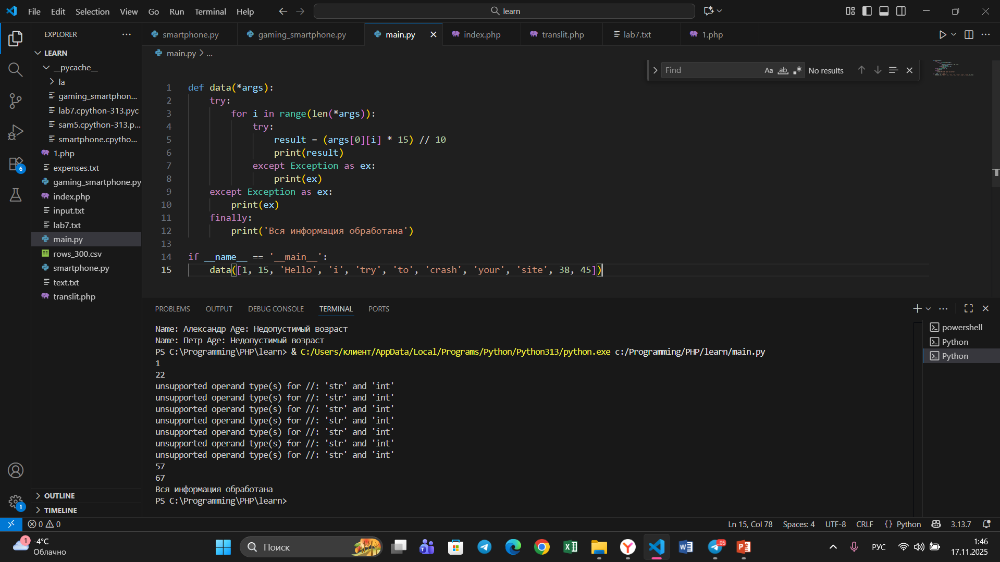
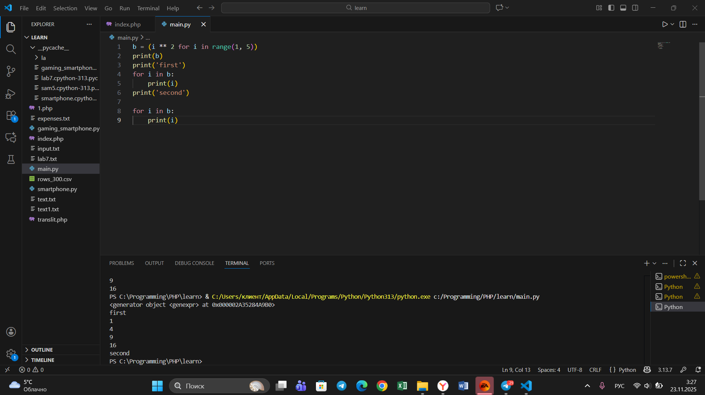
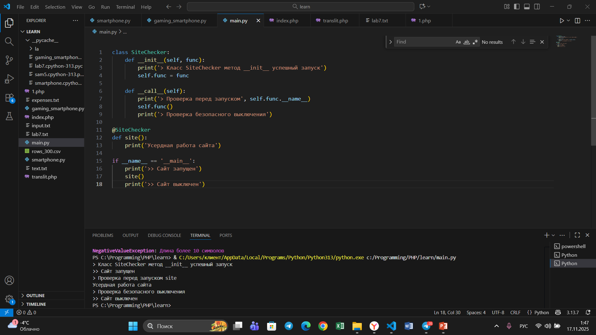
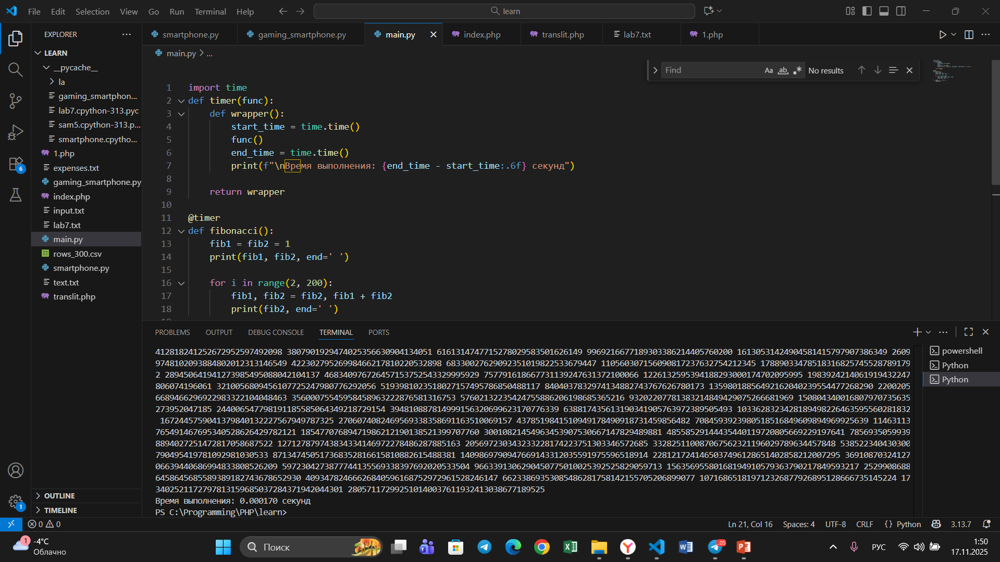

## Тема 10. Декораторы и исключения
Отчет по теме № 10 подготовил(а):
Никитина Вероника Евгеньевна
Пиэ-23-1

| Заданияе | Выполнено |
|-----------|-----------|
| 1         | +         |
| 2         | +         |
| 3         | +         |
| 4         | +         |
| 5         | +         |

## Лабораторные задания
## Задание 1. 
Наверняка вы думаете, что декораторы – это какая-то бесполезная вещь, которая вам никогда не пригодится, но тут вдруг на паре по математике преподаватель просит всех посчитать число Фибоначчи для 100. Кто-то будет считать вручную (так точно не нужно), кто-то посчитает на калькуляторе, а кто-то подумает, что он самый крутой и напишет рекурсивную программу на Python и немного огорчится, потому что данная программа будет достаточно долго считаться, если ее просто так запускать. Но именно тут к вам на помощь приходят декораторы, например @lru_cache (он предназначен для решения задач динамическим программированием, если простыми словами, то этот декоратор запоминает промежуточные результаты и при рекурсивном вызове функции программа не будет считать одни и те же значения, а просто “возьмёт их из этого декоратора”). Вам нужно написать программу, которая будет считать числа Фибоначчи для 100 и запустить ее без этого декоратора и с ним, посмотреть на разницу во времени решения поставленной задачи. P.S. при запуске без декоратора можете долго не ждать, для наглядности хватит 10 секунд ожидания.
```python
from functools import lru_cache

@lru_cache(None)
def fibonacci(n):
    if n == 0:
        return 0
    elif n == 1:
        return 1
    return fibonacci(n - 1) + fibonacci(n - 2)

print(fibonacci(100))
```
Результат.

# Выводы  
__slots__ фиксирует набор атрибутов класса и запрещает создание других атрибутов. Экономит память, убирая __dict__. Подходит для классов с фиксированной структурой.

## Задание 2. 
Илья пишет свой сайт и ему необходимо сделать минимальную проверку ввода данных пользователя при регистрации. Для этого он реализовал функцию, которая выводит данные пользователя на экран и решил, что будет проверять правильность введённых данных при помощи декоратора, но в этом ему потребовалась ваша помощь. Напишите декоратор для функции, который будет принимать все параметры вызываемой функции (имя, возраст) и проверять чтобы возраст был больше 0 и меньше 130. Причем заметьте, что неважно сколько пользователь введет данных на сайт к Илье, будут обрабатываться только первые 2 аргумента.
```python
def check(input_func):
    def output_func(*args):
        name, age = args[0], args[1]
        if age < 0 or age > 130:
            age = 'Недопустимый возраст'
        input_func(name, age)

    return output_func

@check
def personal_info(name, age):
    print(f"Name: {name} Age: {age}")

personal_info('Владимир', 38)
personal_info('Александр', -5)
personal_info('Петр', 138, 15, 48, 2)
```
Результат.


# Выводы  
isinstance(ingredient, str) проверяет, что ingredient является строкой, и только в этом случае добавляет топпинг к мороженому.

## Задание 3. 
Вам понравилась идея Ильи с сайтом, и вы решили дальше работать вместе с ним. Но вот в вашем проекте появилась проблема, кто-то пытается сломать вашу функцию с получением данных для сайта. Эта функция работает только с данными integer, а какой-то недохакер пытается все сломать и вместо нужного типа данных отправляет string. Воспользуйтесь исключениями, чтобы неподходящий тип данных не ломал ваш сайт. Также дополнительно можете обернуть весь код функции в try/except/finally для того, чтобы программа вас оповестила о том, что выявлена какая-то ошибка или программа успешно выполнена.
```python
def data(*args):
    try:
        for i in range(len(*args)):
            try:
                result = (args[0][i] * 15) // 10
                print(result)
            except Exception as ex:
                print(ex)
    except Exception as ex:
        print(ex)
    finally:
        print('Вся информация обработана')

if __name__ == '__main__':
    data([1, 15, 'Hello', 'i', 'try', 'to', 'crash', 'your', 'site', 38, 45])
```

Результат.

# Выводы  
В коде реализована инкапсуляция с использованием сеттера, геттера и деструктора. Возникает ошибка при вызове геттера после удаления значения, так как новое значение не было присвоено.

## Задание 4.
Продолжая работу над сайтом, вы решили написать собственное исключение, которое будет вызываться в случае, если в функцию проверки имени при регистрации передана строка длиннее десяти символов, а если имя имеет допустимую длину, то в консоль выводиться “Успешная регистрация”
```python
class NegativeValueException(Exception):
    pass

def check_name(name):
    if len(name) > 10:
        raise NegativeValueException('Длина более 10 символов')
    else:
        print('Успешная регистрация')

if __name__ == '__main__':
    name = '12345678900'
    check_name(name)
```

Результат.

# Выводы  
В коде реализовано наследование: классы Собака и Кошка наследуются от класса Млекопитающие. Каждый дочерний класс имеет уникальные атрибуты породы и звуков.

## Задание 5. 
После запуска сайта вы поняли, что вам необходимо добавить логгер, для отслеживания его работы. Готовыми вариантами вы не захотели пользоваться, и поэтому решили создать очень простую пародию. Для этого создали две функции: init() (вызывается при создании класса декоратора в программе) и call() (вызывается при вызове декоратора). Создайте необходимый вам декоратор. Выведите все логи в консоль.
```python
class SiteChecker:
    def __init__(self, func):
        print('> Класс SiteChecker метод __init__ успешный запуск')
        self.func = func

    def __call__(self):
        print('> Проверка перед запуском', self.func.__name__)
        self.func()
        print('> Проверка безопасного выключения')

@SiteChecker
def site():
    print('Усердная работа сайта')

if __name__ == '__main__':
    print('>> Сайт запущен')
    site()
    print('>> Сайт выключен')
```

Результат.

# Выводы  
Декоратор @staticmethod позволяет вызывать метод без создания объекта класса.


## Самостоятельные адания
## Задание 1. 
Вовочка решил заняться спортивным программированием на python, но для этого он должен знать за какое время выполняется его программа. Он решил, что для этого ему идеально подойдет декоратор для функции, который будет выяснять за какое время выполняется та или иная функция. Помогите Вовочке в его начинаниях и напишите такой декоратор. Подсказка: необходимо использовать модуль time. Результатом вашей работы будет листинг кода и скриншот консоли, в котором будет выполненная функция Фибоначчи и время выполнения программы. Также на этом примере можете посмотреть, что решение задач через рекурсию не всегда является хорошей идеей. Поскольку решение Фибоначчи для 100 с использованием рекурсии и без динамического программирования решается более десяти секунд, а решение точно такой же задачи, но через цикл for еще и для 200, занимает меньше 1 секунды.
```python
import time
def timer(func):
    def wrapper():
        start_time = time.time()
        func()
        end_time = time.time()
        print(f"\nВремя выполнения: {end_time - start_time:.6f} секунд")

    return wrapper

@timer
def fibonacci():
    fib1 = fib2 = 1
    print(fib1, fib2, end=' ')

    for i in range(2, 200):
        fib1, fib2 = fib2, fib1 + fib2
        print(fib2, end=' ')

if __name__ == '__main__':
    fibonacci()
```

# Выводы  


# Общие выводы  
Все задачи решены успешно
