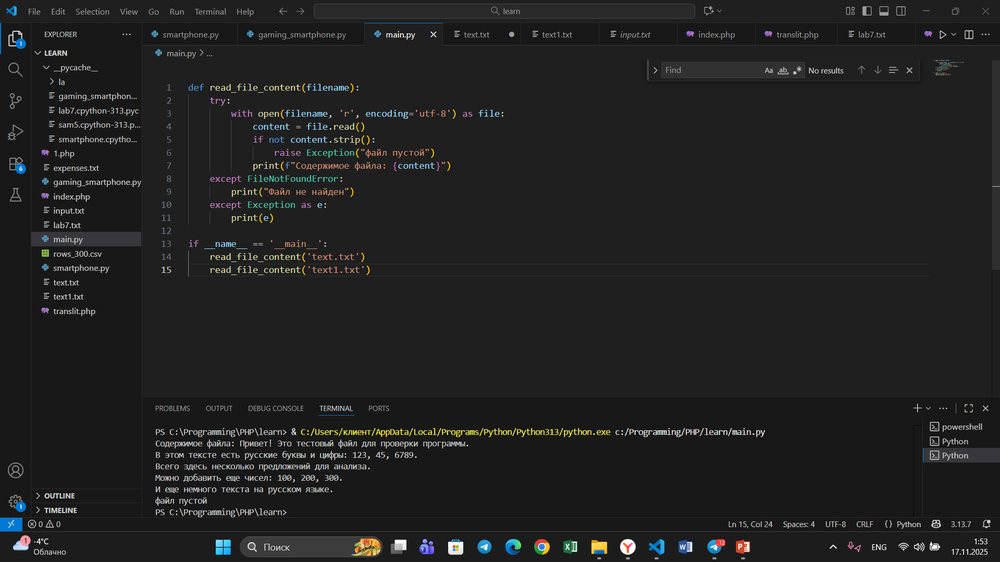
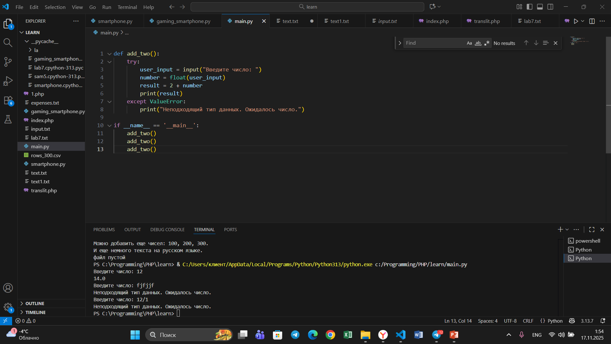

## Тема 11. Итераторы и генераторы
Отчет по теме № 11 подготовил(а):
Никитина Вероника Евгеньевна
Пиэ-23-1

| Заданияе | Выполнено |
|-----------|-----------|
| 1         | +         |
| 2         | +         |
| 3         | +         |
| 4         | +         |
| 5         | +         |

## Лабораторные задания
## Задание 1. 
Простой итератор, но у него нет гибкой настройки, например его нельзя развернуть. Он работает просто как next(), но нет prev()
```python
numbers = [0, 1, 2, 3, 4, 5]
for item in numbers:
    print(item)
```
Результат.

# Выводы  
Обычный цикл for использует функцию iter(), чтобы получить итератор из контейнера. Этот итератор имеет метод next(), который последовательно возвращает элементы. Когда элементы заканчиваются, next() генерирует исключение StopIteration, сигнализирующее циклу о завершении.

## Задание 2. 
Класс итератор с гибкой настройкой и удобными применением
```python
class CountDown:
    def __init__(self, start):
        self.count = start + 1

    def __iter__(self):
        return self

    def __next__(self):
        self.count -= 1
        if self.count < 0:
            raise StopIteration
        return self.count

counter = CountDown(5)
for i in counter:
    print(i)
```
Результат.


# Выводы  
Для создания итератора нужно определить класс с двумя методами:
__iter__() - возвращает сам объект итератора (обычно self)
__next__() - возвращает следующий элемент или вызывает StopIteration

## Задание 3. 
Генератор списка
```python
a = [i ** 2 for i in range(1, 5)]

print('a - ', a)
for i in a:
    print(i)

print('iter(a) - ', iter(a))
for i in a:
    print(i)
```

Результат.

# Выводы  
Мы создали генератор и посмотрели на него тремя способами:
Простой вывод - показывает, что это объект-генератор
Цикл for - выводит все числа по порядку
Функция iter() - получает итератор для ручного перебора элементов

## Задание 4.
Выражения генераторы
```python
b = (i ** 2 for i in range(1, 5))
print(b)
print('first')
for i in b:
    print(i)
print('second')

for i in b:
    print(i)
```

Результат.

# Выводы  
Создали генератор и преобразовали его в список. Выводим список только один раз, потому что генератор после использования "опустошается" - как одноразовый шприц.
## Задание 5. 
Такой же счетчик, как и в первом задании, только это генератор и использует yield
```python
def countdown(count):
    while count >= 0:
        yield count
        count -= 1

counter = countdown(5)
for i in counter:
    print(i)
```

Результат.

# Выводы  
Функция с yield приостанавливает выполнение и возвращает значение, сохраняя своё состояние. При следующем вызове она продолжает работу с места остановки, а не начинает заново.


## Самостоятельные адания
## Задание 1. 
Вас никак не могут оставить числа Фибоначчи, очень уж они вас заинтересовали. Изучив новые возможности Python вы решили реализовать программу, которая считает числа Фибоначчи при помощи итераторов. Расчет начинается с чисел 1 и 1. Создайте функцию fib(n), генерирующую n чисел Фибоначчи с минимальными затратами ресурсов. Для реализации этой функции потребуется обратиться к инструкции yield (Она не сохраняет в оперативной памяти огромную последовательность, а дает возможность “доставать” промежуточные результаты по одному). Результатом решения задачи будет листинг кода и вывод в консоль с числом Фибоначчи от 200.
```python
def fib(n):
    a, b = 1, 1
    for num in range(n):
        yield a
        a, b = b, a + b

n = 243
fibonacci_numbers = list(fib(n))

print(fibonacci_numbers[-1])
```

# Выводы  
Функция fib(n) генерирует последовательность Фибоначчи длиной n:
Начинает с чисел 1, 1
На каждом шаге через yield возвращает текущее число
Обновляет значения для следующего числа
Резульnат преобразуется в список для доступа по индексу

## Задание 2. 
Посмотрев на Вовочку, вы также загорелись идеей спортивного программирования, начав тренировки вы узнали, что для решения некоторых задач необходимо считывать данные из файлов. Но через некоторое время вы столкнулись с проблемой что файлы бывают пустыми, и вы не получаете вводные данные для решения задачи. После этого вы решили не просто считывать данные из файла, а всю конструкцию оборачивать в исключения, чтобы избежать такой проблемы. Создайте пустой файл и файл, в котором есть какая-то информация. Напишите код программы. Если файл пустой, то, нужно вызвать исключение ("бросить исключение") и вывести в консоль "файл пустой", а если он не пустой, то вывести информацию из файла.
```python
def read_file_content(filename):
    try:
        with open(filename, 'r', encoding='utf-8') as file:
            content = file.read()
            if not content.strip():
                raise Exception("файл пустой")
            print(f"Содержимое файла: {content}")
    except FileNotFoundError:
        print("Файл не найден")
    except Exception as e:
        print(e)

if __name__ == '__main__':
    read_file_content('txt1.txt')
    read_file_content('txt2.txt')
```
Результат.



# Выводы  
Функция fib(n) теперь записывает числа Фибоначчи в файл:
Открывает файл fib.txt для записи
На каждой итерации записывает текущее число в файл
Автоматически закрывает файл после завершения


# Общие выводы  
Все задачи решены успешно
