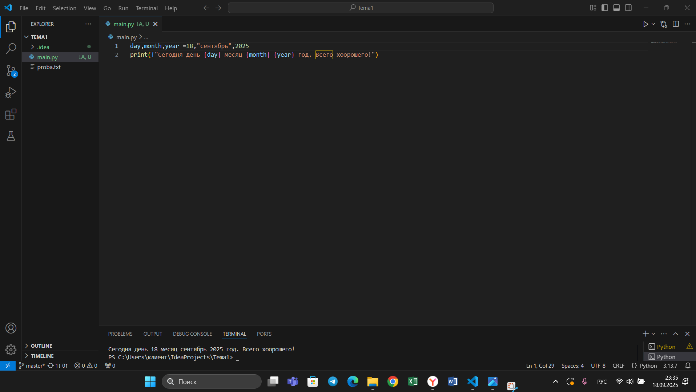

## Тема 7. Базовые коллекции: словари, кортежи.
Отчет по теме № 7 подготовил(а):
Никитина Вероника Евгеньевна
Пиэ-23-1

| Заданияе | Выполнено |
|-----------|-----------|
| 1         | +         |
| 2         | +         |
| 3         | +         |
| 4         | +         |
| 5         | +         |
| 6         | +         |
| 7         | +         |
| 8         | +         |
| 9         | +         |
| 10        | +         |

## Лабораторные задания
## Задание 1. 
Создайте текстовый файл и поместите его в ту же папку, что и программу на Python. Текстовый файл должен состоять как минимум из двух строк.
```python
request = int(input('Ведите номер кабинета: '))
dictionary = {
    101: {'key': 1234, 'access': True},
    102: {'key': 1337, 'access': True},
    103: {'key': 8943, 'access': True},
    104: {'key': 5555, 'access': False},
    None: {'key': None, 'access': False},
}
response = dictionary.get(request)
if not response:
    response = dictionary[None]
key = response.get('key')
access = response.get('access')
print(key, access)

```
Результат.

# Выводы  
С помощью функции get программа получает значения из созданного словаря.

## Задание 2. 
Напишите программу, которая выведет только первую строку из вашего файла, используя конструкцию open()/close().
```python
f = open(r'Lab7.txt', encoding='utf-8')
print(f.readline())
f.close()
```
Результат.


# Выводы  
Метод update позволяет дополнять словарь новыми записями и изменять значения существующих ключей. Исходные данные в словаре остаются неизменными до применения этой функции.

## Задание 3. 
Напишите программу, которая выведет все строки из вашего файла в виде массива, используя конструкцию open()/close().
```python
f = open(r'Lab7.txt', encoding='utf-8')
print(f.readlines())
f.close()
```

Результат.

# Выводы  
Кортеж можно рассматривать как альтернативный способ разбиения строки на символы. Его неизменяемость гарантирует, что полученная последовательность символов останется защищенной от изменений.

## Задание 4.
Напишите программу, которая выведет все строки из вашего файла в виде массива, используя конструкцию with open().
```python
with open('Lab7.txt', encoding='utf-8') as f:
    print(f.readlines())
```

Результат.

# Выводы  
Функция может принимать кортеж в качестве аргумента и обрабатывать его.

## Задание 5. 
Напишите программу, которая будет выводить каждую строку из вашего файла по отдельности, используя конструкцию with open().
```python
with open('Lab7.txt', encoding='utf-8') as f:
    for line in f:
        print(line)
```

Результат.

# Выводы  
Чтобы проверить элементы кортежа на принадлежность к дробным числам, можно использовать isinstance(), указав в качестве параметров проверяемый объект и класс float.

## Задание 6. 
```python
with open('Lab7.txt', 'a+', encoding='utf-8') as f:
    f.write( '\nСтрока стихотворного текста, организованная по определённому ритмическому образцу')

with open(r'Lab7.txt', encoding='utf-8') as f:
    result = f.readlines()
    print(result)

```
Результат.

# Выводы  
С помощью функции get программа получает значения из созданного словаря.

## Задание 7. 

```python
lines = ['one', 'two', 'three']
with open('Lab7.txt', 'w') as f:
    for line in lines:
        f.write('\nCycle run ' + line)
    print('Done!')
```
Результат.


# Выводы  
Метод update позволяет дополнять словарь новыми записями и изменять значения существующих ключей. Исходные данные в словаре остаются неизменными до применения этой функции.

## Задание 8. 

```python
import os

def print_docs(directory):
    all_files = os.walk(directory)
    for catalog in all_files:
        print(f'Папка {catalog[0]} содержит:')
    print(f'Директории: {", ".join([folder for folder in catalog[1]])}')
    print(f'Файлы: {", ".join([file for file in catalog[2]])}')
    print('-' * 48)

print_docs(r"C:\Users\serki\OneDrive\Документы\Вуз\Программная Инженерия\Тема7")
```

Результат.

# Выводы  
Кортеж можно рассматривать как альтернативный способ разбиения строки на символы. Его неизменяемость гарантирует, что полученная последовательность символов останется защищенной от изменений.

## Задание 9
```python
def longest_words(file):
    with open(file, encoding='utf-8') as f:
        words = f.read().split()
        max_length = len(max(words, key=len))
        for word in words:
            if len(word) == max_length:
                sought_words = word

        if len(sought_words) == 1:
            return sought_words[0]
        return sought_words

print(longest_words('input.txt'))
```

Результат.

# Выводы  
Функция может принимать кортеж в качестве аргумента и обрабатывать его.

## Задание 10. 

```python
import csv
import datetime
import time

with open('rows_300.csv', 'w', encoding='utf-8', newline='') as f:
    writer = csv.writer(f)
    writer.writerow(['№', 'Секунда', 'Микросекунда'])
    for line in range(1, 301):
        writer.writerow([line, datetime.datetime.now().second,
                         datetime.datetime.now().microsecond])
        time.sleep(0.01)
```

Результат.

# Выводы  
Чтобы проверить элементы кортежа на принадлежность к дробным числам, можно использовать isinstance(), указав в качестве параметров проверяемый объект и класс float.

## Самостоятельные адания
## Задание 1. 
Найдите в интернете любую статью (объёмом не менее 200 слов), скопируйте её содержимое в файл и напишите программу, которая подсчитает количество слов в текстовом файле и определит самое часто встречающееся слово. Результатом выполнения задачи будут: скриншот файла со статьёй, листинг кода и вывод в консоль, в котором будет указана вся необходимая информация.
```python
from collections import Counter
import re
def count_words_in_file(filename):
    with open(filename, 'r') as file:
        text = file.read().lower()
        words = re.findall(r'\b\w+\b', text)
        word_count = Counter(words)
        most_common_word = word_count.most_common(1)[0]
    return len(words), most_common_word

total_words, most_common_word = count_words_in_file("banana.txt")
print(f"Общее количество слов: {total_words}")
print(f"Самое частое слово: '{most_common_word[0]}', количество вхождений: {most_common_word[1]}")
```

# Выводы  
Программа получает пользовательский ввод, разделяет строку методом split(), после чего выводит как саму разделенную строку (список), так и её версию, преобразованную в кортеж.

## Задание 2. 
У вас возникла потребность вести журнал расходов. Изучив все существующие варианты, вы пришли к выводу, что вас ничего не устраивает и нужно делать всё самостоятельно. Напишите программу для учёта расходов. Программа должна позволять вводить информацию о расходах, сохранять её в файл и выводить существующие данные в консоль. Ввод информации осуществляется через консоль. Результатом выполнения задачи будет: скриншот файла с учётом расходов, листинг кода и вывод в консоль с демонстрацией работоспособности программы.
```python
def add_expense(filename):
    while True:
        expense = input("Введите описание расхода и сумму: ")
        if expense.lower() == 'выйти':
            break
        if expense.strip():
            with open(filename, 'a', encoding='utf-8') as file:
                file.write(expense + "\n")
def show_expenses(filename):
    with open(filename, 'r', encoding='utf-8') as file:
        expenses = file.readlines()
        if expenses:
            print("Ваши расходы:")
            for expense in expenses:
                print(expense.strip())
        else:
            print("Расходов нет.")

filename = "expenses.txt"
add_expense(filename)
show_expenses(filename)
```

# Выводы  
Для изменения кортежа его сначала преобразуют в список, вносят изменения, а затем конвертируют обратно в кортеж.а.

## Задание 3. 

```python
import re

def text_statistics(filename):
    with open(filename, 'r', encoding='utf-8') as file:
        lines = file.readlines()
        num_lines = len(lines)
        num_words = 0
        num_letters = 0
        for line in lines:
            words = line.split()
            num_words += len(words)
            num_letters += len(re.findall(r'[a-zA-Z]', line))
        print(f"Количество букв латинского алфавита: {num_letters}")
        print(f"Количество слов: {num_words}")
        print(f"Количество строк: {num_lines}")

text_statistics("Sam7.txt")
```

# Выводы  
Функция строит частотный словарь символов строки: разбивает строку на символы, подсчитывает их количество, а затем выводит отсортированный результат.

## Задание 4. 

```python
import re
def load_forbidden_words(filename):
    with open(filename, 'r', encoding='utf-8') as file:
        forbidden_words = file.read().split()
    return forbidden_words
def censor_sentence(sentence, forbidden_words):
    for word in forbidden_words:
        pattern = re.compile(re.escape(word), re.IGNORECASE)
        sentence = pattern.sub('*' * len(word), sentence)
    return sentence
forbidden_words = load_forbidden_words("censored.txt")
sentence = "Hello, world! Python IS the programming language of thE future. My EMAIL is....PYTHON is awesome!!!!"
censored_sentence = censor_sentence(sentence, forbidden_words)
print(censored_sentence)
```
Результат.

# Выводы  
Суть в том, чтобы найти два вхождения элемента и вернуть срез между ними, либо срез до конца, если второго вхождения нет.

## Задание 5. 
```python
import re

def compare_letters_and_digits(filename):
    with open(filename, 'r', encoding='utf-8') as file:
            text = file.read()
    russian_letters_count = len(re.findall(r'[а-яА-ЯёЁ]', text))
    digits_count = len(re.findall(r'\d', text))
    if russian_letters_count > digits_count:
        return "В файле больше русских букв."
    elif digits_count > russian_letters_count:
        return "В файле больше цифр."
    else:
        return "Количество русских букв и цифр в файле одинаково."

filename = "new.txt"
result = compare_letters_and_digits(filename)
print(result)
```
Результат.


# Общие выводы  
Все задачи решены успешно
