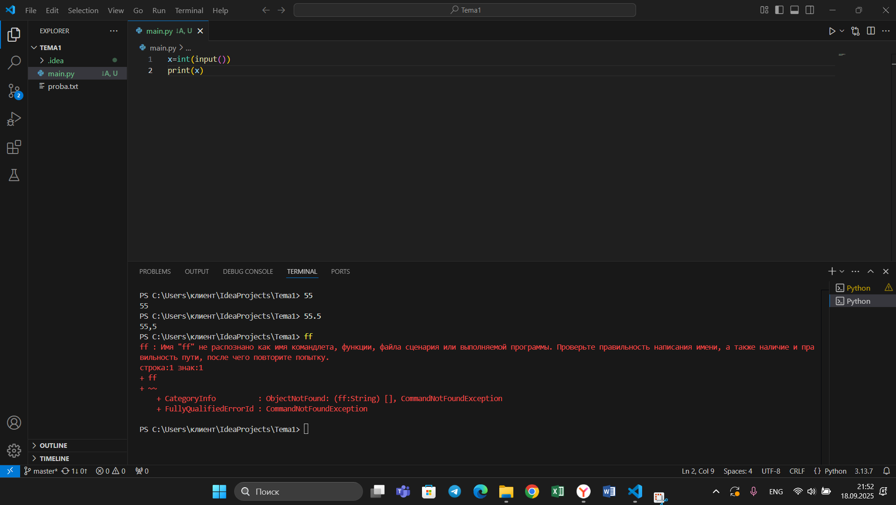
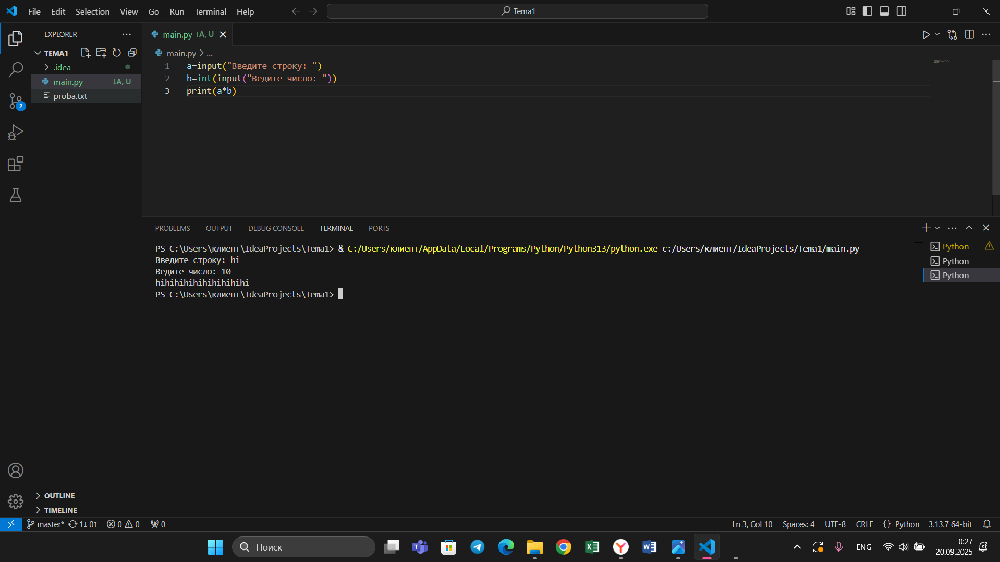

## Тема 2. Базовые операции языка Python
Отчет по теме № 2 подготовил(а):
Никитина Вероника Евгеньевна
Пиэ-23-1

| Заданияе | Выполнено |
|-----------|-----------|
| 1         | +         |
| 2         | +         |
| 3         | +         |
| 4         | +         |
| 5         | +         |
| 6         | +         |
| 7         | +         |
| 8         | +         |
| 9         | +         |
| 10         | +         |

## Задание 1. 

# Выводы  
bool преобразует число 0 в False, а 1 в True

## Задание 2. 

# Выводы  
Присваивать значения нескольким переменным можно в одной строке

## Задание 3. 

# Выводы  
Если ввести буквы в int(input()) будет ошибка

## Задание 4. 

# Выводы  
Можно умножить число на строку и получить длинный вывод

## Задание 5. 

# Выводы  
С помощью f-строки можно свомещать текст и переменные

## Задание 6. 

# Выводы  
С помощью f-строки можно свомещать текст и переменные

## Задание 7. 

# Выводы  
len() считает длину строки

## Задание 8. 

# Выводы
С помощью .lower() можно перевести строку в маленькие буквы

## Задание 9. 

# Выводы
Нужно, чтобы программа запрашивала слово и колличество повторейний этого слова, которое хочет пользователь.

## Задание 10. 

# Выводы
Программа, которая будет запрашивать слово, а затем считать кол-во букв и переводить в разные регистры.

## Общий вывод
Питон легче воспринимается, чем другие языки
