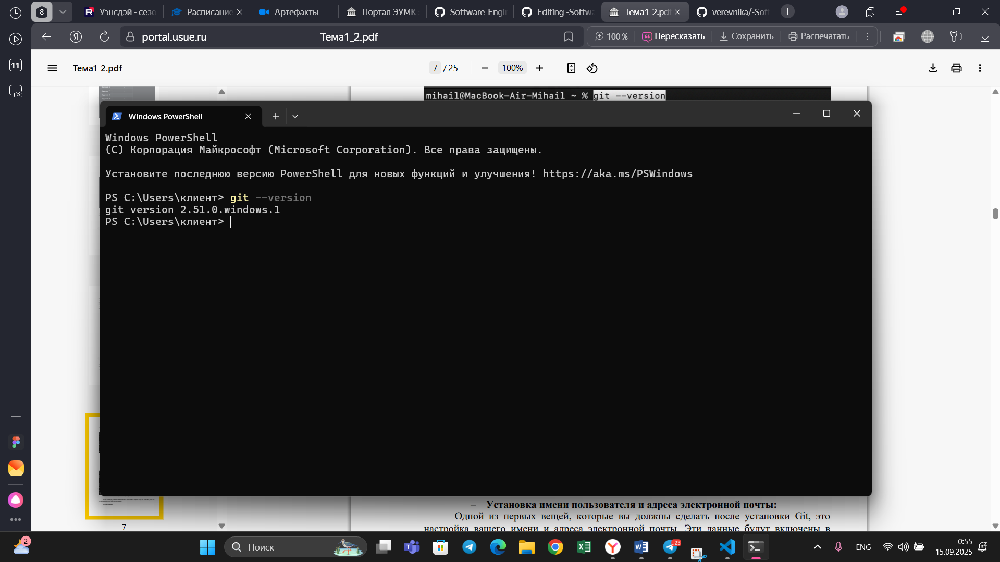

# Тема 1. Введение в Python
Отчет по теме № 1 подготовил(а):  
Никитина Вероника Евгеньевна   
Пиэ-23-1
| Заданияе | Выполнено |
|-----------|-----------|
| 2.1         | +         |
| 2.2         | +         |
| 2.3         | +         |
| 2.4         | +         |
| 2.5         | +         |
| 2.6         | +         |
| 2.7         | +         |
| 2.8         | +         |
| 2.9         | +         |
| 2.10         | +         |
| 2.11         | +         |
| 2.12         | +         |
| 2.13         | +         |
| 2.14         | +         |
| 2.15         | +         |

## Задание 2.1 Установка  
Установка Git
проверка версии Git

# Выводы  
Я установила Git через официальный сайт. Проверила его версию, мне вывело строчку с его веррсией - это значит, все успешно установлено и готово к работе.  

## Задание 2.2 Настройка

# Выводы  
Я настроила свою элктронную почту и имя, это важно сделать после установки Git.  

## Задание 2.3 Создание нового репозитория

# Выводы  
С помощью легких команд можно создать репозитерий  

## Задание 2.4 Подготовка файлов

# Выводы  
Я добавила файл и проверила его статус

## Задание 2.5 Фиксация изменений

# Выводы
Есть много разных варианто ввыведения коммиттов  

## Задание 2.6 Подключение к удаленному репозиторию

# Выводы
К репозиторию можно подключиться удаленно 

## Задание 2.7 Ветвление

# Выводы
Ветвление дает гибкость и контроль над разработой  

## Задание 2.8 Особенности применения «Фетч»

# Выводы
Фетч позволяет нам убедиться, что локальный репозиторий содердит актуальную информацию.  

## Задание 2.9 Удаление файлов, веток, локальных и удалённых репозиториев

# Выводы
