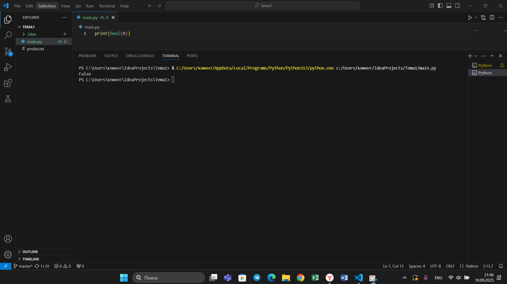
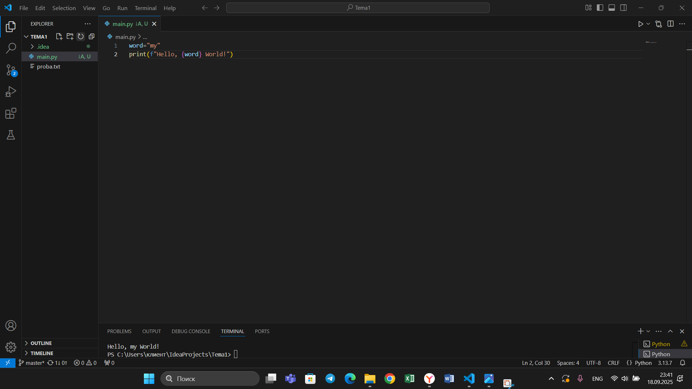

## Тема 5. Базовые коллекции: множества, списки
Отчет по теме № 5 подготовил(а):
Никитина Вероника Евгеньевна
Пиэ-23-1

| Заданияе | Выполнено |
|-----------|-----------|
| 1         | +         |
| 2         | +         |
| 3         | +         |
| 4         | +         |
| 5         | +         |
| 6         | +         |
| 7         | +         |
| 8         | +         |
| 9         | +         |
| 10         | +         |

## Лабораторные задания
## Задание 1. 
```python
set_1={'WHITE','BLACK','RED','PINK'}
set_2={'RED','GREEN','BLUE','RED'}
print('1', set_1 - set_2)
```
Результат.

# Выводы  
Множетсва можно вычитать друг из друга.

## Задание 2. 
```python
a = frozenset('abcdefg')
print(a)
for i in range(1, 5):
    a.add(i)
print(a)
```
```python
a = set('abcdefg')
print(a)
for i in range(1, 5):
    a.add(i)
print(a)
```
Результат.


# Выводы  
С frozenset программа выдает ошибку.

## Задание 3. 
```python
def replace(input_list):
    memory = input_list[0]
    input_list[0] = input_list[-1]
    input_list[-1] = memory
    return input_list

print(replace([1, 2, 3, 4, 5]))
```

Результат.

# Выводы  
В программе мы пошагово меняем элементы через их индексы.

## Задание 4. 
```python
a = [12, 54, 32, 57, 843, 2346, 765, 75, 25, 234, 756, 23]
print(a[2:6])
```

Результат.

# Выводы  
Срез обозначаем так [2:6]

## Задание 5. 
```python
def useless(lst):
    return max(lst) / len(lst)

print(useless([3, 5, 7, 3, 33]))
print(useless([-12.5, 54, 77.3, 0, -36, 98.2, -63, 21.7, 47, -89.6]))
print(useless([-25.8, 86, 12.5, -56, 73.2, 0, 43, -91.5, 65.9, -7]))
```

Результат.

# Выводы  
Ищем максимальное и делим на длину

## Задание 6. 
```python
superheroes = ['superman', 'spiderman', 'batman']

nikolay, vasiliy, ivan, = superheroes

print('Николай - ', nikolay)
print('Василий - ', vasiliy)
print('Иван - ', ivan)
```

Результат.

# Выводы  
Срез обозначаем так [2:6]

## Задание 7. 
```python
a = [-25.8, 86, 12.5, -56, 73.2, 0, 43, -91.5, 65.9, -7]
a.sort()
print('Отсортированный список:\n', a)
a.pop(0)
print('Отсортированный список без наименьшего элемента:\n', a)
```

Результат.

# Выводы  
sort() сортируем список по возрастанию, используем pop(0) и удаляем наименьший элемент.

## Задание 8. 
```python
from random import randint

def list_maker():
    a = [randint(1, 100)] * randint(3, 10)
    return a
result = []
for i in range(randint(1, 5)):
    result.append(list_maker())
print(result)
```

Результат.

# Выводы  
Функция superset() проверяет является ли одно множество подмножеством другого.

## Задание 9. 
```python
def superset(set_1, set_2):
    if set_1 > set_2:
        print(f'Обьект {set_1} является чистым супермножеством')
    elif set_1 == set_2:
        print(f'Множества равны')
    elif set_1 < set_2:
        print(f'Обьект {set_2} является чистым супермножеством')
    else:
        print('Супермножество не обнаружено')

superset({1, 8, 3, 5}, {3, 5})
superset({1, 8, 3, 5}, {5, 3, 8, 1})
superset({3, 5}, {5, 3, 8, 1})
superset({90, 100}, {3, 5})
```

Результат.

# Выводы  
Срез обозначаем так [2:6]

## Задание 10. 
```python
my_list = [2, 5, 8, 3]
print(my_list[::-1])
```

Результат.

# Выводы  
Создаем срез из всех элементов и указываем шаг -1

## Самостоятельные адания
## Задание 1. 
Ресторан на предприятии ведет учет посещений за неделю при помощи кода работника. У них есть список со всеми посещениями за неделю. Ваша задача почитать:
• Сколько было выдано чеков
• Сколько разных людей посетило ресторан
• Какой работник посетил ресторан больше всех раз Список выданных чеков за неделю: [8734, 2345, 8201, 6621, 9999, 1234, 5678, 8201, 8888, 4321, 3365, 1478, 9865, 5555, 7777, 9998, 1111, 2222, 3333, 4444, 5556, 6666, 5410, 7778, 8889, 4445, 1439, 9604, 8201, 3365, 7502, 3016, 4928, 5837, 8201, 2643, 5017, 9682, 8530, 3250, 7193, 9051, 4506, 1987, 3365, 5410, 7168, 7777, 9865, 5678, 8201, 4445, 3016, 4506, 4506] Результатом выполнения задачи будет: листинг кода, и вывод в консоль, в котором будет указана вся необходимая информация.
```python
from collections import Counter

a = [8734, 2345, 8201, 6621, 9999, 1234, 5678, 8201, 8888, 4321, 3365, 1478, 9865, 5555, 7777, 9998, 1111, 2222, 3333, 4444, 5556, 6666, 5410, 7778, 8889, 4445, 1439, 9604, 8201, 3365, 7502, 3016, 4928, 5837, 8201, 2643, 5017, 9682, 8530, 3250, 7193, 9051, 4506, 1987, 3365, 5410, 7168, 7777, 9865, 5678, 8201, 4445, 3016, 4506, 4506]
print(len(a))
print(len(set(a)))
print(Counter(a).most_common(1)[0][0])
```

# Выводы  
С помощью двух интеграций достигли желаемого результата.

## Задание 2. 
Напишите программу, которая фразу «Hello World» выводит в обратном порядке, и каждая буква находится в одной строке консоли. При этом необходимо обязательно использовать любой цикл, а также программа должна занимать не более 3 строк в редакторе кода.
```python
a = [10.2, 14.8, 19.3, 22.7, 12.5, 33.1, 38.9, 21.6, 26.4, 17.1, 30.2, 35.7, 16.9, 27.8, 24.5, 16.3, 18.7, 31.9, 12.9, 37.4]
a_s = sorted(a)
print(a_s)
print(a_s[0:4])
print(a_s[-3:])
print(a_s[10:])
```

# Выводы  
Я спользовала for...in что бы написать слово в обратно порядке.

## Задание 3. 
Напишите программу, на вход которой поступает значение из консоли, оно должно быть числовым и в диапазоне от 0 до 10 включительно (это необходимо учесть в программе). Если вводимое число не подходит по требованиям, то необходимо вывести оповещение об этом в консоль и остановить программу. Код должен вычислять в каком диапазоне находится полученное число. Нужно учитывать три диапазона:
• от 0 до 3 включительно
• от 3 до 6
• от 6 до 10 включительно
Результатом работы программы будет выведенный в консоль диапазон. Программа должна занимать не более 10 строчек в редакторе кода.
```python
from math import sqrt

one = [12, 25, 3, 48, 71]
two = [5, 18, 40, 62, 98]
three = [4, 21, 37, 56, 84]
mp = (max(one) + max(two) +max(three)) / 2
mip = (min(one) + min(two) +min(three)) / 2
max_square = sqrt(mp * (mp - max(one)) * (mp - max(two)) * (mp - max(three)))
min_square = sqrt(mip * (mip - min(one)) * (mip - min(two)) * (mip - min(three)))
print(max_square)
print(min_square)
```

# Выводы  
Для решения задания я использовала два вложенных цикла.

## Задание 4. 
Манипулирование строками. Напишите программу на Python, которая принимает предложение (на английском) в качестве входных данных от пользователя. Выполните следующие операции и отобразите результаты:
• Выведите длину предложения.
• Переведите предложение в нижний регистр.
• Подсчитайте количество гласных (a, e, i, o, u) в предложении.
• Замените все слова "ugly" на "beauty".
• Проверьте, начинается ли предложение с "The" и заканчивается ли на "end".
Проверьте работу программы минимум на 3 предложениях, чтобы охватить проверку всех поставленных условий.
```python
first = [2, 3, 4, 5, 3, 4, 5, 2, 2, 5, 3, 4, 3, 5, 4]
second = [4, 2, 3, 5, 3, 5, 4, 2, 2, 5, 4, 3, 5, 3, 4]
third = [5, 4, 3, 3, 4, 3, 3, 5, 5, 3, 3, 3, 3, 4, 4]
def new(grades):
    result = []
    for grade in grades:
        if grade == 2:
            continue
        if grade == 3:
            result.append(4)
        else:
            result.append(grade)
    return result
print(new(first))
print(new(second))
print(new(third))
```
Результат.

# Выводы  
В этом задание разбираем предложение, заменяем нужные слова.

## Задание 5. 
Составьте программу, результатом которой будет данный вывод в консоль. Программу нужно составить из данных фрагментов кода. Строки кода можно использовать только один раз. Не обязательно использовать все строки кода.
```python
def list_to_set(lst):
    result_set = set()
    counts = {}
    for num in lst:
        counts[num] = counts.get(num, 0) + 1
    for num, count in counts.items():
        result_set.add(num)
        for i in range(2, count + 1):
            result_set.add(str(num) * i)
    return result_set

list_1 = [1, 1, 3, 3, 1]
list_2 = [5, 5, 5, 5, 5, 5, 5]
list_3 = [2, 2, 1, 2, 2, 5, 6, 7, 1, 3, 2, 2]
print(list_to_set(list_1))
print(list_to_set(list_2))
print(list_to_set(list_3))
```
Результат.

# Выводы  
Программа выводит Hello и Hello word 10 раз.

# Общие выводы  
