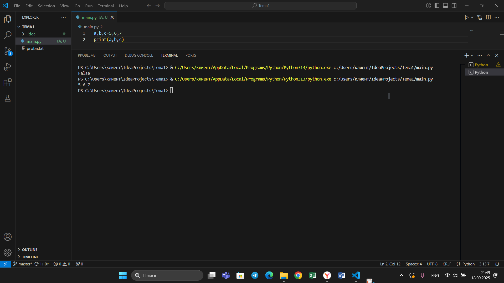

## Тема 6. Базовые коллекции: словари, кортежи.
Отчет по теме № 6 подготовил(а):
Никитина Вероника Евгеньевна
Пиэ-23-1

| Заданияе | Выполнено |
|-----------|-----------|
| 1         | +         |
| 2         | +         |
| 3         | +         |
| 4         | +         |
| 5         | +         |


## Лабораторные задания
## Задание 1. 
В школе, где вы учились, узнали, что вы крутой программист и попросили написать программу для учителей, которая будет при вводе кабинета писать для него ключ доступа и статус, занят кабинет или нет. При написании программы необходимо использовать словарь (dict), который на вход получает номер кабинета, а выводит необходимую информацию. Если кабинета, который вы ввели нет в словаре, то в консоль в виде значения ключа нужно вывести “None” и виде статуса вывести “False”. По большому счету написав данную программу мы с вами научились заменять иногда громоздкую конструкцию if/elif/else. Поскольку здесь функционал словаря полностью повторяет функционал условия, но при этом у использования словарей в более сложных программах есть намного больше возможностей реализации.
```python
request = int(input('Ведите номер кабинета: '))
dictionary = {
    101: {'key': 1234, 'access': True},
    102: {'key': 1337, 'access': True},
    103: {'key': 8943, 'access': True},
    104: {'key': 5555, 'access': False},
    None: {'key': None, 'access': False},
}
response = dictionary.get(request)
if not response:
    response = dictionary[None]
key = response.get('key')
access = response.get('access')
print(key, access)

```
Результат.

# Выводы  
С помощью функции get программа получает значения из созданного словаря.

## Задание 2. 
Алексей решил создать самый большой словарь в мире. Для этого он придумал функцию dict_maker (**kwargs), которая принимает неограниченное количество параметров «ключ: значение» и обновляет созданный им словарь my_dict, состоящий всего из одного элемента «first» со значением «so easy». Помогите Алексею создать данную функцию. Ниже на скриншоте мы использовали встроенный модуль pprint, который выводит большие объемы информации более понятно для восприятия человеческим глазом. Иногда очень удобно использовать данную возможность Python.
```python
from pprint import pprint

my_dict = {'first': 'so easy'}
def dict_maker(**kwargs):
    my_dict.update(**kwargs)
dict_maker(a1=1, a2=20, a3=54, a4=13)
dict_maker(name='Михаил', age=31, weight=70, eyes_color='blue')
pprint(my_dict)
```
Результат.


# Выводы  
Метод update позволяет дополнять словарь новыми записями и изменять значения существующих ключей. Исходные данные в словаре остаются неизменными до применения этой функции.

## Задание 3. 
```python
input_str = 'HelloWorld'
result = tuple(input_str)
print(result)
print(list(result))
```

Результат.

# Выводы  
Кортеж можно рассматривать как альтернативный способ разбиения строки на символы. Его неизменяемость гарантирует, что полученная последовательность символов останется защищенной от изменений.

## Задание 4. 
```python
def personal_info(name, age, company = 'unnamed'):
    print(f'Имя: {name}, Возраст: {age}, Компания: {company}')
one = ('Григорий',25,'Yandex')
two = ('Григорий',45)
personal_info(*one)
personal_info(*two)
```

Результат.

# Выводы  
Функция может принимать кортеж в качестве аргумента и обрабатывать его.

## Задание 5. 
```python
def tuple_sort(trp):
    for elm in trp:
        if not isinstance(elm, int):
            return trp
    return tuple(sorted(trp))
if __name__ == '__main__':
    print(tuple_sort((7,9,10,2,6,1,4)))
    print(tuple_sort((7,9.2,10,2,2,1.5,4)))
```

Результат.

# Выводы  
Чтобы проверить элементы кортежа на принадлежность к дробным числам, можно использовать isinstance(), указав в качестве параметров проверяемый объект и класс float.

## Самостоятельные адания
## Задание 1. 
При создании сайта у вас возникла потребность обрабатывать данные пользователя в странной форме, а потом переводить их в нужные вам форматы. Вы хотите принимать от пользователя последовательность чисел, разделенных пробелом, а после переформатировать эти данные в список и кортеж. Реализуйте вашу задумку. Для получения начальных данных используйте input(). Результатом программы будет выведенный список и кортеж из начальных данных.
```python
str = input()
res = str.split()
print (res)
print(tuple(res))
```

# Выводы  
Программа получает пользовательский ввод, разделяет строку методом split(), после чего выводит как саму разделенную строку (список), так и её версию, преобразованную в кортеж.

## Задание 2. 
Николай знает, что кортежи являются неизменяемыми, но он очень упрямый и всегда хочет доказать, что он прав. Студент решил создать функцию, которая будет удалять первое появление определенного элемента из кортежа по значению и возвращать кортеж без него. Попробуйте повторить шедевр не признающего авторитеты начинающего программиста. Но учтите, что Николай не всегда уверен в наличии элемента в кортеже (в этом случае кортеж вернется функцией в исходном виде).
Входные данные:
(1, 2, 3), 1)
(1, 2, 3, 1, 2, 3, 4, 5, 2, 3, 4, 2, 4, 2), 3)
(2, 4, 6, 6, 4, 2), 9)
Ожидаемый результат:
(2, 3)
(1, 2, 1, 2, 3, 4, 5, 2, 3, 4, 2, 4, 2)
(2, 4, 6, 6, 4, 2)
```python
def remove_elem(trp,elem):
    tuple_list = list(trp)
    if elem in tuple_list:
        tuple_list.remove(elem)
    return tuple(tuple_list)
print(remove_elem((1, 2, 3), 1))
print(remove_elem((1, 2, 3, 1, 2, 3, 4, 5, 2, 3, 4, 2, 4, 2), 3))
print(remove_elem((2, 4, 6, 6, 4, 2), 9))
```

# Выводы  
Для изменения кортежа его сначала преобразуют в список, вносят изменения, а затем конвертируют обратно в кортеж.а.

## Задание 3. 

```python
def count_digit(input_str):
    frequency = {}
    for char in input_str:
        digit = int(char)
        if digit in frequency:
            frequency[digit] += 1
        else:
            frequency[digit] = 1
    sorted_items = sorted(frequency.items(), key=lambda x: x[1], reverse=True)
    res = dict(sorted_items[:3])
    keys = sorted(res.keys())
    for digit in sorted(res.keys()): 
        count = res[digit]
        print(f"Цифра {digit}: встретилась {count} раз(а)")
    return res
count_digit(str(input()))
```

# Выводы  
Функция строит частотный словарь символов строки: разбивает строку на символы, подсчитывает их количество, а затем выводит отсортированный результат.

## Задание 4. 

```python
def extract_subtuple(tup, element):
    if element not in tup:
        return ()
    first_index = tup.index(element)
    try:
        second_index = tup.index(element, first_index + 1)
        return tup[first_index:second_index + 1]
    except ValueError:
        return tup[first_index:]
print(extract_subtuple((1, 2, 3), 8))
print(extract_subtuple((1, 8, 3, 4, 8, 8, 9, 2), 8))
print(extract_subtuple((1, 2, 8, 5, 1, 2, 9), 8))
```
Результат.

# Выводы  
Суть в том, чтобы найти два вхождения элемента и вернуть срез между ними, либо срез до конца, если второго вхождения нет.

## Задание 5. 
```python
def sieve(numbers):
    unique_list = []
    for num in numbers:
        if num not in unique_list:
            unique_list.append(num)
    unique_list.reverse()
    result = tuple(unique_list)
    return result

print(sieve([1, 2, 3, 2, 1, 4, 5]))
print(sieve([3, 3, 3, 3]))
print(sieve([1, 2, 3, 4, 5]))
```
Результат.

# Выводы  
Создаем кортеж с уникальными значениями в обратном порядке

# Общие выводы  
Все задачи решены успешно
